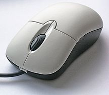

# 软件工程相关名词解释
<dl>
<dt>Computer
    <dd>A computer is a device that can be instructed to carry out sequences of arithmetic or logical operations automatically via computer programming.

The Earliest Electronic General-Purpose Computers

Nowadays——PC

Human–computer interaction

<dt>Computer Science
    <dd>Computer science is the study of the theory, experimentation, and engineering that form the basis for the design and use of computers.

Computer Graphic

NAIDIA

Artificial Intelligence

Different Sorting Algorithm

<dt>Software
    <dd>Computer software, or simply software, is a generic term that refers to a collection of data or computer instructions that tell the computer how to work, in contrast to the physical hardware from which the system is built, that actually performs the work.

Well Interface

OS——Software

<dt>Software Engineering
    <dd>Software engineering is the application of engineering to the development of software in a systematic method.

Business Model

Shell Sort

Quick Sort

<dt>Alan Turing
    <dd>Alan Mathison Turing OBE FRS (/ˈtjʊərɪŋ/; 23 June 1912 – 7 June 1954) was an English computer scientist, mathematician, logician, cryptanalyst, philosopher, and theoretical biologist.Turing was highly influential in the development of theoretical computer science, providing a formalisation of the concepts of algorithm and computation with the Turing machine, which can be considered a model of a general purpose computer.Turing is widely considered to be <strong>the father of theoretical computer science and artificial intelligence</strong>.

Alan Turing

<dt>Moore's Law
    <dd>Moore's law is the observation that the number of transistors in a dense integrated circuit doubles about every two years.

Moore's Law

