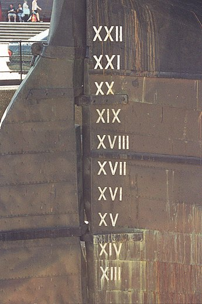

# Part One
## 进制转换
①  1分12秒 = （72000 ）毫秒
② （7A）13 = （101 ）10 
③ （7A）16 = （122 ）10
④ （7A）16 = （1111010）2 = （172）8 
⑤ （1011011）2 = （133 ）8 = （5B ）16 
⑥ （678）10 = （‭001010100110‬）2 = （1246 ）8 
⑦ （111）2 + （101）2 = （1100 ）2

# Part Two

## 名称解释

<dl>
<dt>Information</dt>
<dd>Information is any entity or form that provides the answer to a question of some kind or resolves uncertainty. It is thus related to data and knowledge, as data represents values attributed to parameters, and knowledge signifies understanding of real things or abstract concepts.  
The concept that information is the message has different meanings in different contexts.  
Information can be encoded into various forms for transmission and interpretation (for example, information may be encoded into a sequence of signs, or transmitted via a signal). It can also be encrypted for safe storage and communication.

"Wikipedia" represented in binary

Partial map of the Internet, with nodes representing IP addresses

</dd>

<dt>Positional notation
<dd>
Positional notation or place-value notation is <strong>a method of representing or encoding numbers</strong>. Positional notation is distinguished from other notations (such as Roman numerals) for its use of the same symbol for the different orders of magnitude (for example, the "ones place", "tens place", "hundreds place"). This greatly simplified arithmetic, leading to the rapid spread of the notation across the world.
  
With the use of a radix point (decimal point in base-10), the notation can be extended to include fractions and the numeric expansions of real numbers.
  
<strong>The Babylonian numeral system</strong>, base-60, was <strong>the first positional system</strong> developed, and its influence is present today in the way time and angles are counted in tallies related to 60, like 60 minutes in an hour, 360 degrees in a circle. The Hindu–Arabic numeral system, base-10, is the most commonly used system in the world today for most calculations. <strong>The binary numeral system, base-2, is straightforwardly implemented in digital electronic circuitry and used by almost all computer systems and electronics for calculations and representations</strong>.

Roman Numerals——Different from Positional notation

Glossary of terms used in the positional numeral systems

不同的进制之间可互相转换，如： 
（7A）16 = （1111010）2 = （172）8 

</dd>

<dt>Algorithm
<dd>
In mathematics and computer science, an algorithm is<strong> an unambiguous specification of how to solve a class of problems</strong>. Algorithms can perform calculation, data processing and automated reasoning tasks.
  
As an effective method, <strong>an algorithm can be expressed within a finite amount of space and time and in a well-defined formal language for calculating a function.</strong> Starting from an initial state and initial input (perhaps empty), the instructions describe a computation that, when executed, proceeds through a finite number of well-defined successive states, eventually producing "output" and terminating at a final ending state. The transition from one state to the next is not necessarily deterministic; some algorithms, known as randomized algorithms, incorporate random input.

QuickSort Algorithm

ShellSort Algorithm

Different Sorting Algorithm

Flowchart of Alogrithm for GCD 

<dt>Software bug
<dd>A software bug is an<strong> error, flaw, failure or fault in a computer program or system</strong> that causes it to <strong>produce an incorrect or unexpected result, or to behave in unintended ways</strong>.
 
Most bugs arise from mistakes and errors made in either a program's source code or its design, or in components and operating systems used by such programs. A few are caused by compilers producing incorrect code. A program that contains a large number of bugs, and/or bugs that seriously interfere with its functionality, is said to be buggy (defective). Bugs can trigger errors that may have ripple effects. Bugs may have subtle effects or cause the program to crash or freeze the computer. Other bugs qualify as security bugs and might, for example, enable a malicious user to bypass access controls in order to obtain unauthorized privileges.

Bug in Game

Bug in Code

BluetoothBug

How to prevent?
<ol>
<li>Typographical errors</li>
<li>Development methodologies</li>
<li>Programming language support</li>
<li>Code analysis</li>
<li>Instrumentation</li>
</ol>
</dd>

##进制——英语

<ol>
<li>十进制:Decimal</li>
<li>二进制:Binary</li>
<li>八进制:Octal</li>
<li>十六进制:Hexadecimal</li>
</ol>
