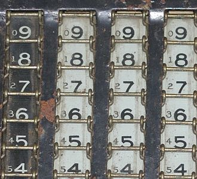

# 第三次作业

## Part One

<ol>
<li>
int8_t x=(67)10=(00100011)2 
int8_t y=(-7)10=(11111001)2 
int8_t z = y - x =(-74)10=(10110110)2 
<li>
int8_t x = (0xd3)16=(11010011)2——溢出
<li>
uint8_t x = (0xd3)16=(11010011)2
<li>
int8_t x = (127)10=(01111111)2 
int8_t y = (-7)10=(11111001)2 
int8_t z = y – x=(-134)10=(‭10000110‬)‭2——溢出
<li>
float x = (1.125)10=(1.001)2
<li>
float x = (23.0)10=(10111)2
<li>
float x = (0.45)10=(0.011100110011······)2——出现精度误差
</ol>

## Part Two

### 名词解释

<dl>
<dt>Method of complements</dt>
<dd>
In mathematics and computing, the method of complements is a technique used to subtract one number from another using only addition of positive numbers. This method was commonly used in mechanical calculators and is still used in modern computers.

>The radix complement of an n digit number y in radix b is, by definition, $b^{n}-y$.

Example: 
Calculate this: 
873(x, the minuend) - 218(y, the subtrahend)

First Method:

126(nines' complement of x)+218(the subtrahend)=344(result) while 655 is nine's complement of result, the correct answer.  

Second Method: 

873  (x) + 781  (nines' complement of y = 999-y)=1654  (999 + x-y) 
The leading "1" digit is then dropped, giving 654. 
1654 - 1000(=999+1) = 654 
This is not yet correct. We have essentially added 999 to the equation in the first step. Then we removed 1000 when we dropped the leading 1 in the result 1654 above. This will thus make the answer we get (654) one less than the correct answer (x-y). To fix this, we must add 1 to our answer: 
654+1=655=x-y;

Nine's Complement

<strong></strong>
</dd>
<dt>Byte</dt>
<dd>
The byte is a unit of digital information that most commonly consists of eight bits, representing a binary number. Historically, the byte was the number of bits used to encode a single character of text in a computer and for this reason it is the smallest addressable unit of memory in many computer architectures.
 The size of the byte has historically been hardware dependent and no definitive standards existed that mandated the size – byte-sizes from to 48 bits are known to have been used in the past.Early character encoding systems often used six bits, and machines using six-bit and nine-bit bytes were common into the 1960s. These machines most commonly had memory words of 12, 24, 36, 48 or 60 bits, corresponding to two, four, six, eight or 10 six-bit bytes. In this era, bytes in the instruction stream were often referred to as syllables, before the term byte became common.  The modern de-facto(约定俗成的) standard of eight bits, as documented in ISO/IEC 2382-1:1993, is a convenient power of two permitting the values 0 through 255 for one byte. The international standard IEC 80000-13 codified this common meaning. Many types of applications use information representable in eight or fewer bits and processor designers optimize for this common usage. The popularity of major commercial computing architectures has aided in the ubiquitous acceptance of the eight-bit size.Modern architectures typically use 32- or 64-bit words, built of four or eight bytes.
  
The unit symbol for the byte was designated as the upper-case letter B by the International Electrotechnical Commission (IEC) and Institute of Electrical and Electronics Engineers (IEEE) in contrast to the bit, whose IEEE symbol is a lower-case b. Internationally, the unit octet, symbol o, explicitly denotes a sequence of eight bits, eliminating the ambiguity of the byte.
</dd>
<dt>Integer (computer science)</dt>
<dd>
In computer science, an integer is a datum of integral data type, a data type that represents some range of mathematical integers. Integral data types may be of different sizes and may or may not be allowed to contain negative values. Integers are commonly represented in a computer as a group of binary digits (bits). The size of the grouping varies so the set of integer sizes available varies between different types of computers. Computer hardware, including virtual machines, nearly always provide a way to represent a processor register or memory address as an integer.  

The value of an item with an integral type is the mathematical integer that it corresponds to. Integral types may be unsigned (capable of representing only non-negative integers) or signed (capable of representing negative 
integers as well).

Some integral data types

|Programming Language|Type|Bytes|unsigned range|signed range|
|--|--|--|--|--|
|C\C++|short|2|0 to 65,535|−32,767 to 32,767|
|C ISO/ANSI C99|long(Unix,16/32-bit systems Windows,16/32/64-bit systems)|4(minimum requirement 4)|0 to 4,294,967,295(minimum requirement)|−2,147,483,647 to +2,147,483,647 | 
|C ISO/ANSI C99|long(Unix,64-bit systems)|8|0 to 18,446,744,073,709,551,615|−9,223,372,036,854,775,807 to +9,223,372,036,854,775,807|
|C++ ISO/ANSI 、C++/CLI|long(16/32-bit systems)|4(minimum requirement 4)|0 to 4,294,967,295(minimum requirement)|−2,147,483,648 to +2,147,483,647|
|C#|short|2|0 to 65,535|−32,767 to 32,767|
||long or Int64|8|0 to 18,446,744,073,709,551,615|−9,223,372,036,854,775,808 to +9,223,372,036,854,775,807|
|Java|short|2|N/A|−32,768 to 32,767|
||long|8|N/A|−9,223,372,036,854,775,808 to +9,223,372,036,854,775,807|
</dd>
<dt>Floating point</dt>
<dd>
In computing, floating-point arithmetic (FP) is arithmetic using formulaic representation of real numbers as an approximation so as to support a trade-off between range and precision. For this reason, floating-point computation is often found in systems which include very small and very large real numbers, which require fast processing times. A number is, in general, represented approximately to a fixed number of significant digits (the significand) and scaled using an exponent in some fixed base; the base for the scaling is normally two, ten, or sixteen. A number that can be represented exactly is of the following form:

$significand×base^{exponent}$

where significand is an integer (i.e., in Z), base is an integer greater than or equal to two, and exponent is also an integer. For example:

The term floating point refers to the fact that a number's radix point (decimal point, or, more commonly in computers, binary point) can "float"; that is, it can be placed anywhere relative to the significant digits of the number. This position is indicated as the exponent component, and thus the floating-point representation can be thought of as a kind of scientific notation(科学记数法).

<strong>Range of floating-point numbers</strong>

A floating-point number consists of two fixed-point components, whose range depends exclusively on the number of bits or digits in their representation. Whereas components linearly depend on their range, the floating-point range linearly depends on the significand range and exponentially on the range of exponent component, which attaches outstandingly wider range to the number.

On a typical computer system, a double precision (64-bit) binary floating-point number has a coefficient of 53 bits (including 1 implied bit), an exponent of 11 bits, and 1 sign bit. Since 210 = 1024, the complete range of floating-point numbers in this format is from approximately 2−1023 ≈ 10−308 to 21023 ≈ 10308 (see [IEEE 754](https://en.wikipedia.org/wiki/IEEE_754)).

<strong>UFL And OFL</strong>

The number of normalized floating-point numbers in a system (B, P, L, U) where 
B is the base of the system, 
P is the precision of the system to P numbers, 
L is the smallest exponent representable in the system, 
and U is the largest exponent used in the system)
is 
$2\left(B-1\right)\left(B^{P-1}\right)\left(U-L+1\right)+1$  
There is a smallest positive normalized floating-point number—— 
Underflow level = UFL =$B^{L}$ 
which has a 1 as the leading digit and 0 for the remaining digits of the significand, and the smallest possible value for the exponent.
There is a largest floating-point number, 
Overflow level = OFL = $\left(1-B^{-P}\right)\left(B^{U+1}\right)$ 
which has B − 1 as the value for each digit of the significand and the largest possible value for the exponent.

In addition, there are representable values strictly between −UFL and UFL. Namely, positive and negative zeros, as well as denormalized numbers.
</dd>
</dl>

仔细阅读” Method of complements”的内容，你将注意到nines‘ complement in
the decimal 和ones' complement in binary 等概念.
1)请证明：二进制的负数（two's complement of X）等于X 的ones’
complement ＋ 1（即，X每位求反加1） 
证明:

$\because b^n-1=(b-1)(b^{n-1}+b^{n-2}+···+b+1)=(b-1)b^{n-1}+(b-1)b^{n-2}+···+（b-1） $
$\therefore 2^k-1=1_11_2···1_k$
$\because$对于k位二进制位表示的正数X，其二进制位每位取反的结果与自身相加显然为$1_11_2···1_k=2^k-1$，加一后得到$2^k$，即$2^k=(X)_2+[One's\space  Complement\space  of\space  (X)_2+1]$ 
$\therefore[One's\space Complement\space  of\space  (X)_2+1]=2^k-(X)_2$ 
又$\because$根据负数在计算机(二进制)中的表示方法知
$(-X)_2=2^k-(X)_2$ 
$\therefore(-X)_2=[One's\space Complement\space  of\space  (X)_2+1]$
 $\therefore$二进制的负数等于X的每位求反加1，得证。  
2)Int8_t x = -017; 请用8进制描述变量x。在c中017即$(017)_8$
阅读维基百科” Two's complement”的内容，特别是Sign extension小节内容。
 解：
$x=(-15)_{10}=(111,110,001)_2=(761)_8$

1)C程序：int8_t x = -0x1f; int y = x; 请用16进制描述变量x 和y，并说明int y = x 的计算过程。 
解:$x=(-31)_{10}=(11100001)_2=(0XE1)_{16}$ 
$y=(1110,0001)_2=(‭1111,1111,1111,1111,1111,1111,1110,0001‬)_2=(0X‭FFFFFFE1‬)_{16}$ 
说明：
int8_t是八位二进制数，在32位系统中是现代操作系统中，int一般占用4个字节（Byte）的内存，为32位二进制数，在增加二进制数的位数时需要进行符号拓展操作(Sign extension),即在保留值的同时需要保留其符号（+/-）,即使符号位在重要的一侧填充（此处为左侧）$(11100001)_2$在二进制中的符号位为1，因此在二进制位增加时需要在左侧填充1，最终得到$(‭1111,1111,1111,1111,1111,1111,1110,0001‬)_2$,即$(0X‭FFFFFFE1‬)_{16}$

2)请用数学证明，为什么可以这么计算。 
证明： (1)对于负数，当二进制位增加时需在左侧填充符号位(1)，假设原数X为一M位二进制数，位数增加后变位N位二进制数。 设$(X)_2=1Q_1Q_2···Q_{M-1}$($Q_i$表示第i个未知的二进制位，后同)，则位数增加后得到：$(Y)_2=1_11_2···1_{N-M+1}Q_1Q_2···Q_{M-1}$($1_i$表示式中第i个1) 对X和Y各位取反后X和Y的后M-1位是相同的，而其它位全为零，即： $(X)_2=0P_1P_2···P_{M-1}$ $(Y)_2=0_10_2···0_{N-M+1}P_1P_2···P_{M-1}$($P_i$是对$Q_i$取反的结果) 显然两数此时相等，因此两数分别加1后也相等(因为X的第一位为零，也不存在溢出的情况)，所以$(Y)_2$和$(X)_2$的补码相等，即它们代表的是同一个数，所以当位数增加时在左侧填充符号位可以在保留值的同时保留其符号。 
(2)对于正数(包括0)，当位数增加时在左侧填充符号位（0）显然不会改变数值，因此正数显然可以用同样的方法计算。 
得证。

阅读维基百科"Floating point"的内容，
1) NaN 是什么？ 
答：1985年，IEEE 754指定一个称为“非数字”（NaN）的特殊值，作为某些“无效”操作的结果返回，即在计算中表示未定义或不可表示值的数值数据类型值，尤其是在浮点计算中，例如0/0未定义为实数，∞×0无法计算得到数值，因此由NaN表示；负数的平方根是虚数，因此不能表示为实数浮点数，因此用NaN表示。 
返回NaN的运算有如下三种(参考自
<a href="https://docs.oracle.com/cd/E19957-01/806-3568/ncg_goldberg.html">What Every Computer Scientist Should Know About Floating-Point</a>)： 
<ol>
<li>至少有一个参数是NaN的运算</li>
<li>不定式
<ul>
<li>下列除法运算：0/0、∞/∞、∞/−∞、−∞/∞、−∞/−∞</li>
<li>下列乘法运算：0×∞、0×−∞</li>
<li>下列加法运算：∞ + (−∞)、(−∞) + ∞</li>
<li>下列减法运算：∞ - ∞、(−∞) - (−∞)</li>
</ul>
</li>
<li>产生复数结果的实数运算。例如：
<ul>
<li>对负数进行开偶次方的运算</li>
<li>对负数进行对数运算</li>
<li>对正弦或余弦到达域以外的数进行反正弦或反余弦运算</li>
</ul>
</li>
</ol>
 

在浮点数运算中，NaN与无穷大的概念不同，尽管两者均是以浮点数表示实数时的特殊值。无效操作（Invalid Operation）同样也不同于算术溢出（可能返回无穷大）和算术下溢出（可能返回最小的一般数值、特殊数值、零等）。

>IEEE 754-1985中，用指数部分全为1、小数部分非零表示NaN。以32位IEEE单精度浮点数的NaN为例，按位表示即：S111 1111 1AXX XXXX XXXX XXXX XXXX XXXX，S为符号位，符号位S的取值无关紧要；A是小数部分的最高位（ the most significant bit of the significand），其取值表示了NaN的类型：X不能全为0，并被称为NaN的payload。