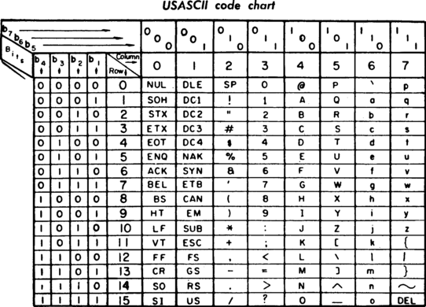
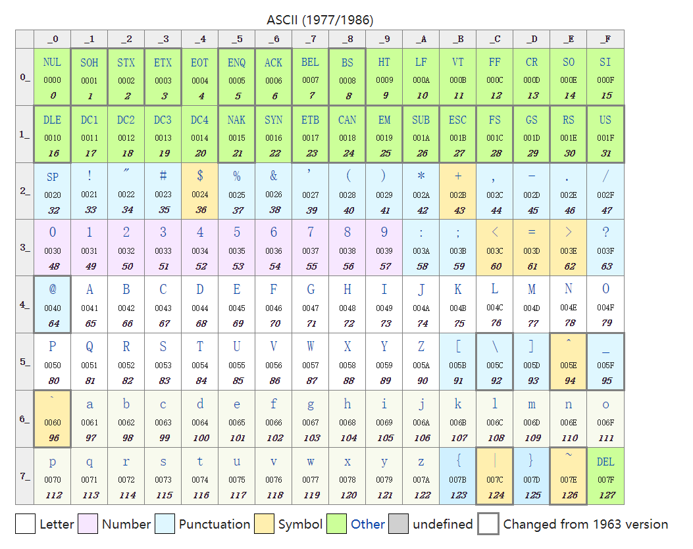
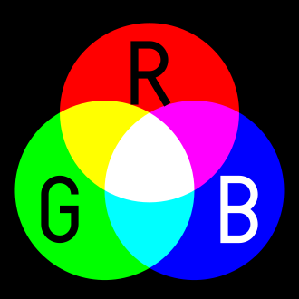

# 名词解释

<dl>
<dt>ASCII</dt>
<dd>
ASCII (/ˈæskiː/ ASS-kee), abbreviated from American Standard Code for Information Interchange, is a character encoding standard for electronic communication. ASCII codes represent text in computers, telecommunications equipment, and other devices. Most modern character-encoding schemes are based on ASCII, although they support many additional characters.  
ASCII is the traditional name for the encoding system; the Internet Assigned Numbers Authority (IANA) prefers the updated name US-ASCII, which clarifies that this system was developed in the US and based on the typographical symbols predominantly in use there. 

USASCII Code Chart

Some Common ASCII Code

</dd>

<dt>Color</dt>
<dd>
Color is the visual perceptual property corresponding in humans to the categories called red, yellow, blue, etc.Check my blog <a href="lab04.md" >颜色编码技术小科普</a> for more information about color coding.
 

><dl><dt>The RGB color model</dt><dd>The RGB color model is an additive color model in which red, green and blue light are added together in various ways to reproduce a broad array of colors.</dd></dl>

Colors

RGB

</dd>

</dl>

#回答问题：

-  写出字符“A”,“中”的 ASCII 码、Unicode 码、
utf-8 编码。

|Char|ASCII|Unicode|UTF-8|
|:--|:-:|:--:|:--:|
|A|01000001|00000000 01000001|01000001|
|中|/|01001110 00101101|11100100 10111000 10101101|

- 黄色(yellow)的RGB编码是:RGB（255, 255, 0).

- 从网上下载一个 BMP 格式图像,用图片编辑工具另存在 jpg、 png、tiff 格式。问三种格式中,哪种格式显示质量好?相对于BMP 格式,压缩率各是多少?
 使用.BMP文件大小为2.86 MB (3,003,056 字节)
Png格式和Tiff格式的显示质量较好，两者差不多，而Jpg格式看起来也并没有差多少。压缩率见下表。

||JPG|PNG|TIFF|
|--|--|--|--|
|Size|98.1 KB (100,549 Bits)|794 KB (813,882 Bits)|757 KB (775,662 Bits)|
|Compression ratio|3.35%|27.10%|25.83%|

- Winrar压缩文件是lossless, or lossy 方法？

答：Winrar压缩文件是lossless方法，即无损压缩。
