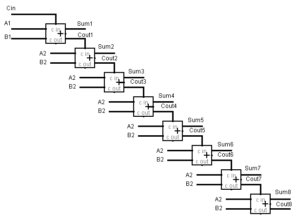

# Homework 5

## Part One

1) Give the three representations of an AND gate and say in your words what AND means.

(1)A*B

(2)

(3) 
|A|B|A*B|
|--|--|:--:|
|0|0|0|
|0|1|0|
|1|0|0|
|1|1|1|
- 与门就是指A和B同时为1时输出1，否则输出0

2) Give the three representations of an XOR gate and say in your words what XOR means.

(1)A XOR B

(2)

(3)
|A|B|A XOR B|
|--|--|:--:|
|0|0|0|
|0|1|1|
|1|0|1|
|1|1|0|

3) Draw a circuit diagram corresponding to the following Boolean expression: (A + B)(B + C)

 

4) Show the behavior of the following circuit with a truth table.

- $ （A^{'}） XOR（A*B）  $

5) What is circuit equivalence? Use truth table to prove the
following formula:(AB)’ = A’ + B’.

- 电路等效指两个电路对外性能相同，即对于所有相同的输入拥有相同的输出。

|A|B|(AB)'|A'+B'|
|--|--|--|--|
|0|0|1|1|
|0|1|1|1|
|1|0|1|1|
|1|1|0|0|

从上图可看出两电路等效,即(AB)' = A' + B'.

6) There are eight 1bit full adder integrated circuits.Combine them to 8bit adder circuit using the following box diagram.

7) Logical binary operations can be used to modify bit pattern. Such as$(X_8X_7X_6X_5X_4X_3X_2X_1)_2\space and\space (00001111)_2 = (0000X_4X_3X_2X_1)_2$.We called that $(00001111)_2$ is a mask which only makes low 4 bits to work.
Fill the follow expression
(1) $ (X_8X_7X_6X_5X_4X_3X_2X_1)_2\space or\space (00001111)_2 = (X_8X_7X_6X_51111)_2$
(2) $ (X_8X_7X_6X_5X_4X_3X_2X_1)_2\space xor\space (00001111)_2 = (X_8X_7X_6X_5X_4^{'}X_3^{'}X_2^{'}X_1^{'})_2 $
(3) $ ((X_8X_7X_6X_5X_4X_3X_2X_1)_2\space and\space (11110000)_2 )\space or\space (not (X_8X_7X_6X_5X_4X_3X_2X_1)_2\space and\space (00001111)_2) = (X_8X_7X_6X_5X_4^{'}X_3^{'}X_2^{'}X_1^{'})_2 $

## Part Two

使用维基百科，解释以下概念。

<dl>
<dt>Logic gate</dt>
<dd>
In electronics, a logic gate is an idealized or physical device implementing a Boolean function; that is, it performs a logical operation on one or more binary inputs and produces a single binary output. Depending on the context, the term may refer to an ideal logic gate, one that has for instance zero rise time and unlimited fan-out, or it may refer to a non-ideal physical device.

And Gate

XOR Gate

</dd>

<dt>Boolean algebra</dt>
<dd>
In mathematics and mathematical logic, Boolean algebra is the branch of algebra in which the values of the variables are the truth values true and false, usually denoted 1 and 0 respectively. Instead of elementary algebra where the values of the variables are numbers, and the prime operations are addition and multiplication, the main operations of Boolean algebra are the conjunction and denoted as ∧, the disjunction or denoted as ∨, and the negation not denoted as ¬. It is thus a formalism for describing logical relations in the same way that elementary algebra describes numeric relations.

</dd>
</dl>
自学存储电路。维基百科：“Flip-flop”，选择中文：

1)Flip-flop 中文翻译是？

- Flip-flop 中文翻译是触发器.

2)How many bits information does a SR latch store?

- 1位