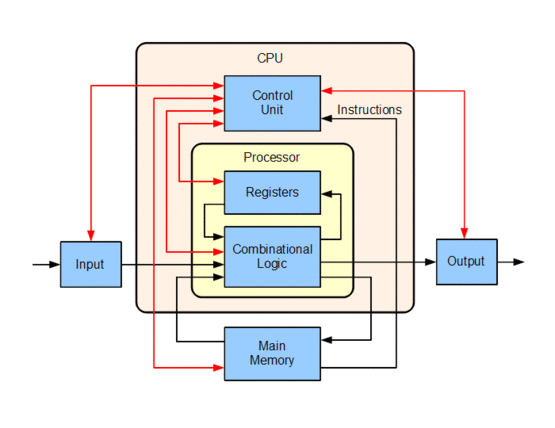
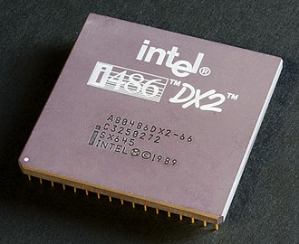
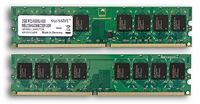
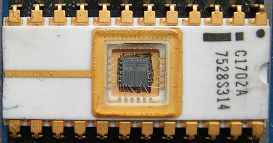
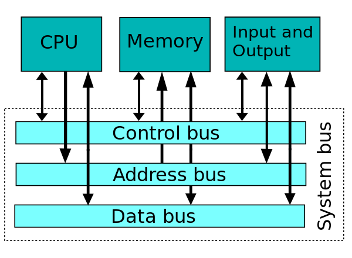
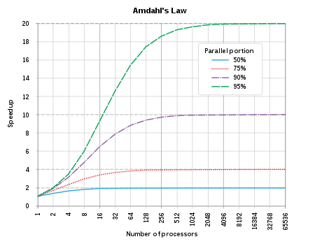

# Homework 6

1、According to the von Neumann architecture, List basic parts of a computer.

根据冯·诺伊曼体系我们可以把电脑分为以下几个基本组成部分：

- 运算器
- 控制器
- 存储器 
- 输入设备
- 输出设备

2、A computer has 64 MB (megabytes) of memory. How many bits are needed to address any single byte in memory?

- 内存空间为64MB=226bytes=(26+220)bytes,因此需要log2226=26bits给内存中的每一个byte定址。

3、List basic parts of a CPU, include cache or not?

CPU的基本组成如下：

- ALU(Algorithmic and Logic Unit)——算术逻辑单元
- Register——寄存器,包括通用寄存器、专用寄存器和控制寄存器
- Control unit——控制单元，由指令寄存器IR(Instruction Register)、指令译码器ID(Instruction Decoder)和操作控制器OC(Operation Controller)三个部件组成

4、What mean secondary storage. List some on your PC.

- 二级存储指的是计算机主存储器或内存之外的所有可访问数据存储器。比如电脑的硬盘、u盘、CD、DVD等。

5、使用维基百科，解释以下概念：

<dl>
<dt>CPU</dt>
<dd>
A central processing unit (CPU) is the electronic circuitry within a computer that carries out the instructions of a computer program by performing the basic arithmetic, logical, control and input/output (I/O) operations specified by the instructions. Traditionally, the term "CPU" refers to a processor, more specifically to its processing unit and control unit (CU), distinguishing these core elements of a computer from external components such as main memory and I/O circuitry.

Block diagram of a basic uniprocessor-CPU computer

An Intel 80486DX2 CPU

</dd>

<dt>RAM</dt>
<dd>
Random-access memory (RAM /ræm/) is a form of computer data storage that stores data and machine code currently being used. A random-access memory device allows data items to be read or written in almost the same amount of time irrespective of the physical location of data inside the memory.

Synchronous Dynamic RAM modules

</dd>

<dt>ROM</dt>
<dd>
Read-only memory (ROM) is a type of non-volatile memory used in computers and other electronic devices. Data stored in ROM can only be modified slowly, with difficulty, or not at all, so it is mainly used to store firmware (software that is closely tied to specific hardware, and unlikely to need frequent updates) or application software in plug-in cartridges.

The first EPROM, an Intel 1702

</dd>

<dt>Bus (computing)</dt>
<dd>
In computer architecture, a bus[1] (a contraction of the Latin omnibus) is a communication system that transfers data between components inside a computer, or between computers. This expression covers all related hardware components (wire, optical fiber, etc.) and software, including communication protocols.

Single system bus

</dd>

<dt>Parallel Computing</dt>
<dd>
Parallel computing is a type of computation in which many calculations or the execution of processes are carried out simultaneously.[1] Large problems can often be divided into smaller ones, which can then be solved at the same time.There are several different forms of parallel computing: bit-level, instruction-level, data, and task parallelism.

> Optimally, the speedup from parallelization would be linear—doubling the number of processing elements should halve the runtime, and doubling it a second time should again halve the runtime. However, very few parallel algorithms achieve optimal speedup. Most of them have a near-linear speedup for small numbers of processing elements, which flattens out into a constant value for large numbers of processing elements.
The potential speedup of an algorithm on a parallel computing platform is given by Amdahl's law: $S_{latency}(s)={1\over{1-p+{p \over s}}} $.

 Amdahl's law

</dd>
</dl>

6、写一段文字，简单解释“云计算（cloud computing）”

- 云计算是由于互联网和计算机软硬件的发展以及人们对于计算能力的需求不断提高而催生出来的产物。云集结了很多很多的计算资源，而不仅仅是一个离我们很遥远的服务器，而是由许许多多分散世界各地的服务器组成的一个系统。当用户使用云计算时，将计算任务提交到云端，云端将任务按照特定的算法分散为许多小的任务分发给各个机器同时执行，但计算结束后，云端整合这些计算结果并返回给用户，这样使得用户只需要连接上云端，就能够体验每秒10万亿次的运算能力，甚至能够在自己的笔记本上模拟气候变化，或核爆（小心为好:joy:）。云计算正被应用在像物联、网络安全、存储、游戏等各个领域。另外，云计算有如下几个层次的服务：基础设施即服务（IaaS）、平台即服务（PaaS）、软件即服务（SaaS）。

7、小孙买了计算机主板，说明书表明“支持双通道DDR3-1333内存，最大支持16G”。备注:维基百科（中文）“DDR3 SDRAM”

1）DDR3内存，“3”和“1333”的含义是什么？

- “3”代表这是第三代DDR存储器（双倍数据率同步动态随机存取存储器），“1333”代表它的数据传输速率为 1333${1\over3}$MT/s≈1333MT/s，

2）小孙买8G DDR3-1600的内存能提高性能吗？

- 不可以，主板不支持

3）小孙买4G*2 DDR3-1333的内存能提高性能吗？

- 能

4）16G需要多少位地址？

- 内存空间为16GB=234bytes=(24+230)bytes,因此需要log2234=34bits给内存中的每一个byte定址。
