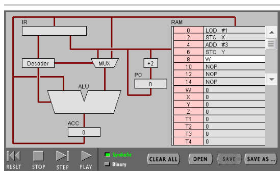

# Homework 7

1、Program with machine language according to the following c.
int_8 a = 1;
int_8 c = a + 3;
1）Write your assembly code & machine code

```
//Pippin——assembly code
LOD #1
STO X
ADD #3
STO Y

//machine code
00010100 00000001 //LOD #1
00000101 10000001 //STO X
00010000 00000011 //ADD #3
00000101 10000010 //STO Y
```



2）Explain machine code execution with the fetch-decode-execute cycle

>CPU的提取解码执行循环即从PC寄存器获取下一条指令地址→从缓存或者内存中取得指令存放于IR寄存器，PC指向下一条指令地址→对IR中的指令进行翻译，变成CPU能够理解的具体功能→按照翻译结果，执行运算动作→将运算结果写回存储器中

3）Explain functions about IR, PC, ACC registers in a CPU

> IR(Instruction Register),指令寄存器是在CPU里用来保存当前正在执行的一条指令的寄存器。
PC(Program Counter),程序计数器的作用是用来指出下一条指令在主存储器中的地址，每执行完一条指令若不跳转则自动增至内存中下一条指令的地址，否则修改值为跳转的地址。
ACC(Accumulator),累加寄存器的作用是当运算器的算术逻辑单元ALU执行算术或逻辑运算时，为ALU提供一个工作区，可以为ALU暂时保存一个操作数或运算结果。

4）Explain physical meaning about vars a & c in a machine

> 变量在计算机里代表了数据的存储位置，声明变量时就是确定了这个存储位置，而给变量赋值即在这个指定的存储空间内存放一系列的01串，出了变量的作用域即指这个存储位置不可访问或已经收回。

2、简答题
1）What are stored in memory?

> 01串，即以二进制表达的各种数据和代码程序。

2）Can a data or a instruction stored in the same place?

> 可以，冯·诺依曼结构中指令和数据是不加区别混合存储的、共享数据总线。

3） Explain Instruction Format with example instructions.

> 00010100 00000001 
//LOD #1
上述指令将数值1读取到ACC中，前八位为命令指示，后八位为读取的数值或地址。其中命令指示的第四位代表寻址模式，为1代表后八位读取的是数值，若为0则后八位是地址，而其中后四位为操作码，即0100是LOD的二进制表达；后八位在这里是一个数值，若寻址模式位为0则这八位代表地址。

3、解释以下词汇
1）汇编语言（Assembly Language）

>An assembly (or assembler) language, often abbreviated asm, is any low-level programming language in which there is a very strong correspondence between the program's statements and the architecture's machine code instructions.


>汇编语言是高级语言与机器语言之间的桥梁，编译器将抽象的、更符合人类大脑思维的高级语言翻译为汇编语言，再由汇编程序将其翻译为由01串组成的难懂的机器语言。它是一种用于电子计算机、微处理器、微控制器，或其他可编程器件的低级语言。它只能专用于某种计算机系统结构，不同于其它可以在不同操作系统上移植的高级语言。汇编语言中，用助记符(Memoni)代替操作码，用地址符号(Symbol)或标号(Label)代替地址码。这样用符号代替机器语言的二进制码，就把机器语言变成了汇编语言。于是汇编语言亦称为符号语言。

2）编译（Compiler）


如果是Compiler应该指编译器，如果指的是编译的话解释如下：
> 编译是将高级语言源程序转换为机器目标代码文件的过程。

如果是编译器的话：
> 编译器（compiler），是一种计算机程序，它会将用某种编程语言写成的源代码（原始语言），转换成另一种编程语言（目标语言）。
A compiler is computer software that primarily translates computer code from a high-level programming language to machine code to create an executable program.


3）命令式语言（Imperative programming）

>In computer science, imperative programming is a programming paradigm that uses statements that change a program's state.
命令式编程是一种描述计算机所需作出的行为的编程典范。因为命令式编程的基础观念，不但概念上比较熟悉，而且较容易具体表现于硬件，所以大部分的编程语言都是命令式的(如Fortran、C等）。大部分的高级语言都支持四种基本的语句：运算语句；循环语句；条件分支语句；无条件分支语句（如goto）。

4）函数编程语言（Functional programming）

>In computer science, functional programming is a programming paradigm—a style of building the structure and elements of computer programs—that treats computation as the evaluation of mathematical functions and avoids changing-state and mutable data.
函数式编程，或称函数程序设计，又称泛函编程，是一种编程典范，它将计算机运算视为数学上的函数计算，并且避免使用程序状态以及易变对象。函数编程语言最重要的基础是λ演算。典型的函数式编程语言有：Haskell、Lisp等

5）过程式编程（Procedural programming）
>Procedural programming is a programming paradigm, derived from structured programming, based upon the concept of the procedure call. 
过程式程序设计，又称过程式编程、过程化编程，一种编程典范，有时会被视为是指令式编程的同义语。典型的过程式编程语言有：Fortran、ALGOL、COBOL、BASIC、Pascal和C。