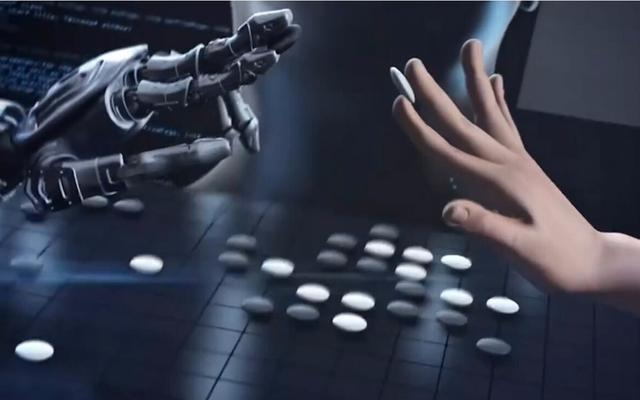

### --说在前头
作为第一个博客也不知道要写什么，本来想写八皇后、迷宫或者连连看这些初学者看着新鲜的东西，但是先前的代码丢了，暂时没时间打也不想拿别人的代码讲所以留着以后聊聊。于是挑了人工智能这个时髦的话题，毕竟好像现在什么东西不沾上人工智能就很低能:joy:

# 聊一聊人工智能的前世今生
> Sometimes it is the people who no one imagines anything of , that do the things that no one can imagine.
> 
--Alan Mathison Turing

## 1.计算机科学之父

[Alan Turing](https://zh.wikipedia.org/wiki/%E8%89%BE%E4%BC%A6%C2%B7%E5%9B%BE%E7%81%B5)

说起人工智能，当然必须聊一聊计算机，一方面是因为人工智能的实现离不开计算机，另一方面还因为一个人——图灵，计算机之父也是人工智能之父。
图灵是一个具有悲剧色彩的人物(推荐电影《[模仿游戏](https://movie.douban.com/subject/10463953/)》))，尽管他为计算机的实现打下了理论基础——理想的图灵机，并且对于人工智能的发展有诸多贡献——例如众所周知的图灵测试，但是，作为一个性取向与时代取向相悖的伟大科学家，他因为性取向遭受到的歧视却比作为一个伟大科学家应当受到的尊敬和优待来的早得多，以至于人们在他因同性恋被定“不体面罪”而受到化学阉割并最终自杀的50多年后，英国首相布朗才在一份几千人签名请愿书下向这位计算机之父和二战英雄做了官方道歉：“我们很抱歉。你本该被更好对待。(We are sorry. You deserved so much better.)”
>2013年12月24日，在英国司法部长Chris Grayling的要求下，英国女王向图灵颁发了皇家赦免。英国司法部长宣布，“图灵的晚年生活因为其同性取向（同性恋）而被迫蒙上了一层阴影，我们认为当时的判决是不公的，这种歧视现象现在也已经遭到了废除。为此，女王决定为这位伟人送上赦免，以此向其致敬。”
***
题外话说多了，回到正题： 
图灵在1950年发表了论文《计算机器与智能》（ [Computing Machinery and Intelligence](https://www.csee.umbc.edu/courses/471/papers/turing.pdf)），为后来的人工智能科学提供了开创性的构思，提出著名的“图灵测试”，指出如果有超过30%的测试者无法辨别人类与人工智能机器反应的差别，则可以论断该机器具备人工智能，尽管30%在当前科技水平下或许不那么准确，但却是首次对人工智能做出了判定并且仍然影响着现在的判定标准。因此，在不断推崇计算机与人工智能发展的现在，我们应当记住这个曾经被人们辜负的伟人，给他应有的崇高的敬意！

>1936年，图灵向伦敦权威的数学杂志投了一篇论文，题为《论数字计算在决断难题中的应用》。在这篇开创性的论文中，图灵给“可计算性”下了一个严格的数学定义，并提出著名的“图灵机”(Turing Machine)的设想。“图灵机”不是一种具体的机器，而是一种思想模型，可制造一种十分简单但运算能力极强的计算机装置，用来计算所有能想像得到的可计算函数。

[John von Neumann](https://zh.wikipedia.org/wiki/%E7%BA%A6%E7%BF%B0%C2%B7%E5%86%AF%C2%B7%E8%AF%BA%E4%BC%8A%E6%9B%BC)

## 基本概念
>Artificial intelligence (AI), sometimes called machine intelligence, is intelligence demonstrated by machines, in contrast to the natural intelligence displayed by humans and other animals.                          
————From WikiPedia

早些年我们可能还认为人工智能是多么高大上的东西，而现如今无人驾驶、人机博弈、语音助手等贴近人们生活的技术不断成熟让我们认识到人工智能已经进入了我们的生活。然而事实上人工智能这一研究领域早在1956年达特茅斯学院举行的一次会议上正式确立了，直到近年来由于深度学习算法和大数据的发展而再次兴起，期间已经经历了数次低潮和高峰期。

2016年AlphaGo Lee击败李世乭让人们再一次对人工智能充满期许。
尽管AI能够战胜人类所有的棋手，甚至能够在所有规则驱动的任务中胜过人类，但是有些任务却不然。
>“人工智能已经在几乎所有需要思考的领域超过了人类，但是在那些人类和其它动物不需要思考就能完成的事情上，还差得很远。”
——计算机科学家Donald Knuth

这里有一段载自网络的一段话，我觉得比较好地说明了这一点(可能部分有失偏颇）——
>造一个能在瞬间算出十位数乘法的计算机——非常简单
造一个能分辨出一个动物是猫还是狗的计算机——极端困难
造一个能战胜世界象棋冠军的电脑——早就成功了
造一个能够读懂六岁小朋友的图片书中的文字，并且了解那些词汇意思的电脑——谷歌花了几十亿美元在做，还没做出来。
一些我们觉得困难的事情——微积分、金融市场策略、翻译等，对于电脑来说都太简单了
我们觉得容易的事情——视觉、动态、移动、直觉——对电脑来说太TM的难了。

事实上上面这几句话可能不那么确切，但是也直观地说明了——AI在某些方面仍然存在不足，对于现在的AI来说可能不是上面提到的不足，而是它过于专事专用，复用性不高，更重要的是大部分仍然属于监督学习，
这里需要引出另外
之后更是研发出了在训练了72小时后就能打败战胜李世乭的 AlphaGo Lee的AlphaGo Zero，相比较 AlphaGo Lee 训练了几个月，它在40天后，它能以89:11的成绩，将战胜了所有人类高手的 Master 甩在后面。AI给我们带来的震撼应该说是前所未有的。
## 发展史概述

你会使用 git bash 创建本地空间了吗？

你能拉取本文档到本地了？它在 gh-pages 分支内，设置 Slate 主题！

用 vscode 编辑它，然后提交！

这个文档将发布在 https://your-account.github.io/homework 中！