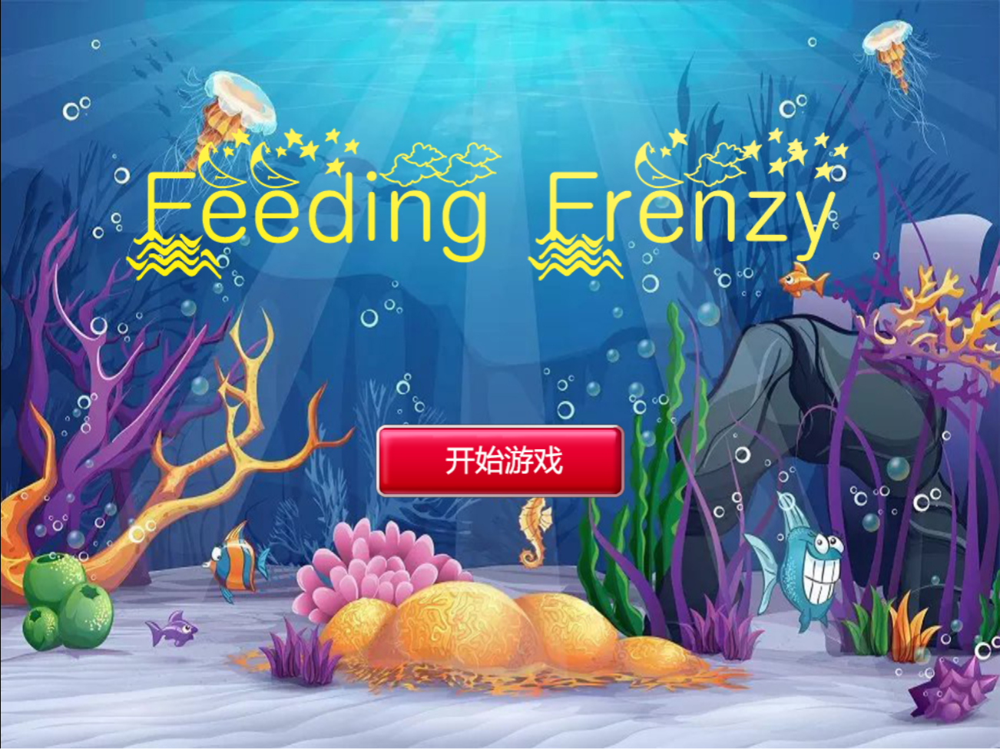
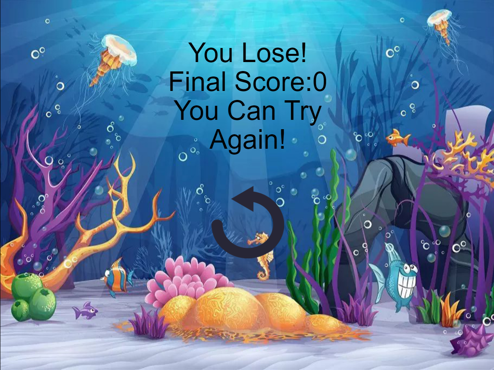
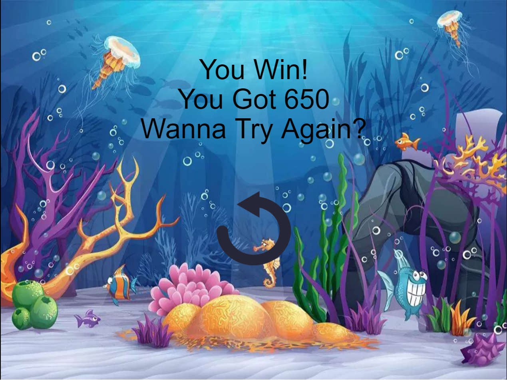
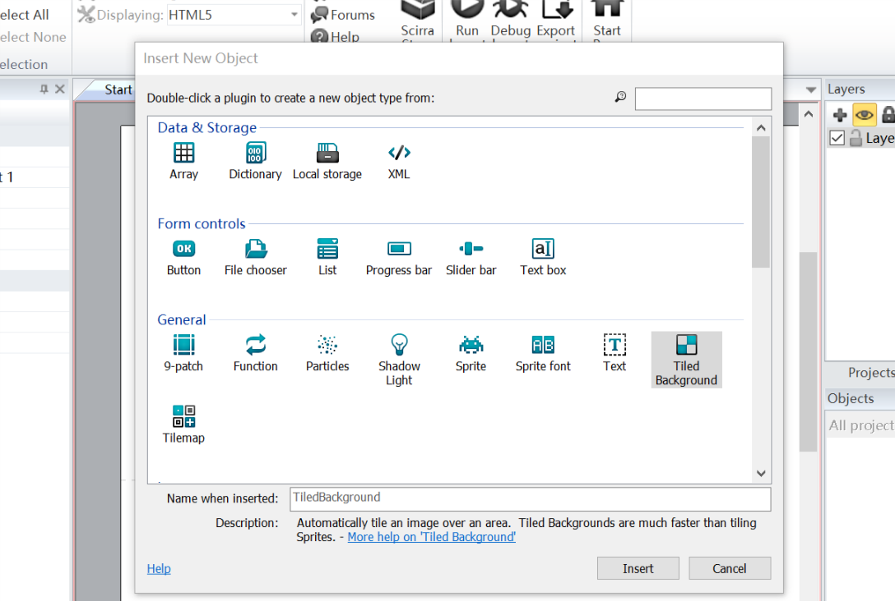
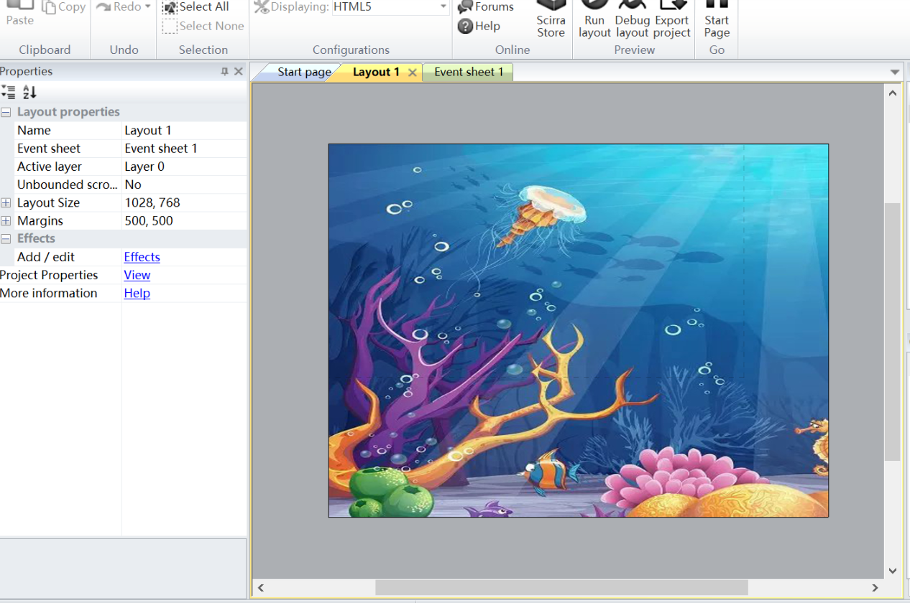
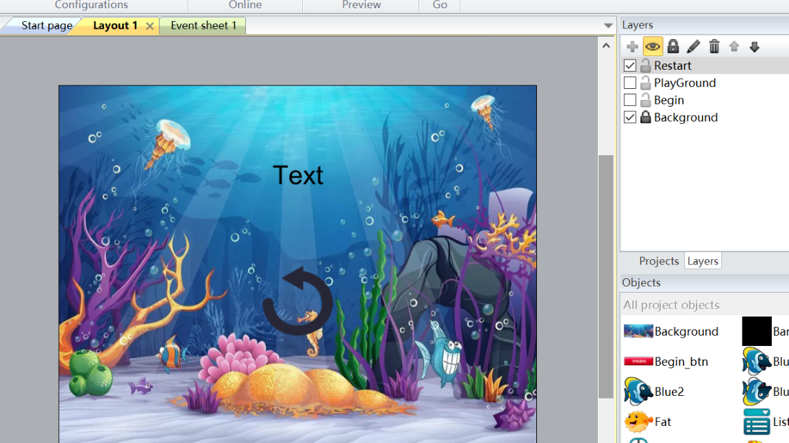
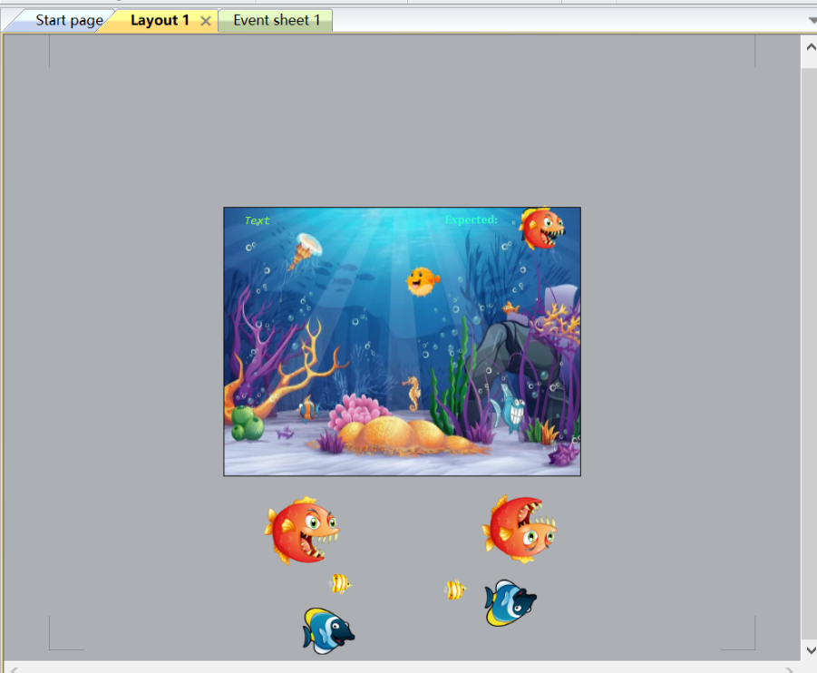

# 用Construct2制作Feeding Frenzy(大鱼吃小鱼)游戏

考虑了半天要做什么小游戏，就想写点童年回忆的小游戏，先倒腾了黄金矿工，素材准备好、开始界面弄好、背景弄好、人物弄好，结果卡在运动动作上，还不如直接用h5...罢了... 
最后决定做大鱼吃小鱼这个（当时:joy:）人尽皆知、老少皆宜的小游戏。

## 半成品

首先，十分感谢Construct2软件的开发者，再有~感谢[三元素网](3png.com)和[巧办网](qiao88.com)较开放的素材资源，解决了我找不到鱼的困境，还要感谢[http://www.shiwusui.com/](http://www.shiwusui.com/)的艺术字转换为开始页面提供了好看的标题。最终得到的游戏界面如下：

开始界面

游戏界面

被吃了

胜利登上食物链顶端

事实上这是个半成品，因为🐠的随机出现可能由于内置的random函数的问题总是导致几条🐠同时出现，所以暂时只能以一定间隔时长出鱼，随机性不够，发现有好的办法再改进吧。

## 游戏制作过程

### 场景布置

创建Empty Project后双击Layout1白色面板，双击Tiled Background选中自行选好的背景素材。调整图片大小，并调整视口大小，使得整个图片填充整个游戏界面，我的图形及视口大小均设为1028*768，效果最终如下:

为了方便，接下来用这样的方式说明步骤：
Project面板->选中Layout1->Rename->BackGround 
Project面板->选中Layout1->Lock 
将默认Layout名改为背景并锁定，使得后续操作不会对它发生影响。

Project->Add layer at top->Rename->Begin
创建开始界面
Project->Add layer at top->Rename->PlayGround
创建游戏界面(属性页面设置初始invisible)
Project->Add layer at top->Rename->Restart
创建Restart界面（赢或输）(属性页面设置初始invisible)

选择Begin面板->双击Layout1区域->Sprite->点击放置贴图的区域->Title图片
选择插入的Title->属性栏设置合适的size
同理插入开始游戏按钮（软件自带默认button太丑）
现在已经完成了开始界面，效果同上展示部分。

双击Layout1区域->Mouse
进入EventSheet界面->Add Event:
Condition:
Mouse->On Project Clicked->Object Clicked->开始游戏按钮
Action:
System->Set Layer Visible->2,visible
System->Set Layer Visible->1,invisible
Mouse->Set Cursor Style->None
设置点击开始游戏按钮后触发的行为

Layout->Begin和Playground前的勾去掉
使Begin层和Playground层在编辑区域不可见，进入的Restart层的编辑

现在隐藏Begin和Background层，显示Restart层，并在水平中央添加Text和restart按钮，效果如下图:

进入EventSheet界面->Add Event:
Condition:
Mouse->On Project Clicked->Object Clicked->Restart按钮
Action:
System->Reset global variables
System->Set Layer Visible->2,visible
System->Set Layer Visible->3,invisible
System->Restart Layout
Mouse->Set Cursor Style->None

Layout->Restart前的勾去掉
使Restart层在编辑区域不可见，进入的Playground层的编辑

### 游戏区域布置

选中Playground层->双击Layout1区域->Sprite->点击放置贴图的区域（我将其放在界面下方）->选择🐠的图片->Crop transparents edges
选择插入的🐠->属性栏设置合适的size
插入🐠并将透明区域边界去掉 
用上述方式插入若干条不同的鱼（向右运动的鱼，若初始不是向右的🐠，在图像编辑区将其翻转）

创建反向运动的🐠（向左的鱼），逐条点击插入的鱼，右键->Clone Object Type->点击合适的放置区域->修改🐠的大小与原来的🐠一致->双击🐠进入图像编辑区->flip上下颠倒（因为反向运动需要设置180°的运动方向，最终是正常显示的，所以不用在意）

在各条鱼的左侧属性栏上添加Behaviors
Behaviors->Add new->Bullet->Speed->250（每条鱼可设置不一样的速度）
使除了主角🐠外的其它🐠全部自行游动

同样的方法插入主角🐠，但只需插入并将其置于背景图上,另外在Behaviors里加上BoundToLayout。

在左上角添加一个Text文本框(文字通过每帧动态更新），右上角也添加一个Text文本框(内容固定为Expected:),在右上角文本框右侧重叠放置Clone Object Type创建的无Bullet行为的非主角鱼（用于显示当前主角🐠可以吃的最大的鱼的类型）。

当前制作效果应当如下所示：

### 游戏行为

Event Sheet内右键创建Global variable——Score->初始值为0
创建全局变量——分数

Add Event:
Condition:
System->Every Tick
System->Layout is visible->2(当前位于Playground层)
Action:
Text(Playground左上角文本框)->Set Text->"Score:"&Score
Mine(主角鱼)->Set Position->X:Mouse.X
 Y:Mouse.Y

Add Event:
Condition:
System->on the start of layout->SmallFish->visible
System->on the start of layout->BigFish->invisible
游戏开始时将小鱼的图标在右上角显示,大鱼的图标隐藏

Add Event:
Condition:
Mine->Compare Height->Greater than->BigFish
Mine->Compare Height->Less than BiggerFish
Action:
SmallFish->set visible->invisible
BigFish->set visible->visible
BiggerFish->set visible->invisible
显示当前能吃的最大的鱼

Add Event:
Condition:
System->Every X Second->设置鱼重复出现的间隔时间
Action:
System->Create Object->重复出现的鱼->Layout(2),X(右行鱼：-100；左行鱼：1100,可自行更改),Y(自行设置);
如果是左行鱼，请加入
Action:
Fliped Fish->Set Bullet Angel of motion->180

>初始的鱼如果在页面中的话，Destory一条鱼其它鱼也会跟着消失，不明白什么BUG...所以我把初始的几条鱼全部放在底部,因此如果只是间隔出鱼的话刚开始要等几秒，所以可以在场景开始时先插入几只鱼：
System->Create Object->重复出现的鱼->Layout(2),X(右行鱼：-100；左行鱼：1100,可自行更改),Y(自行设置);
System->on the start of layout->Each Fliped Fish->Set Bullet Angel of motion->180
把所有刚才上下颠倒的🐠的Bullet Angel of motion设为180°，使得其能正常移动。

Add Event:
Condition:
Mine->on collision with SmallFish(高度始终比Mine小)
System->Layout is visible->2(检查当前是否在Playground层)
Action:
SmallFish->Destory
System->Add to ->Score->5
Mine->Set Size-> Width:Fat.Width+(Fat.Width/abs(Fat.Width))*5  Height:Fat.Height+(Fat.Height/abs(Fat.Height))*4.5
碰到小鱼进行的操作无需比较大小，需：销毁小鱼、加分、改变主角鱼的大小（因为宽高有时候可能出现负值所以用x/|x|的方法取符号乘以增量后再相加）

Add Event：
Condition：
Mine->on collision with BigFish
System->System->Layout is visible->2(检查当前是否在Playground层)
{
Sub-Condition:
Mine->Compare Height->Less than->BigFish
Action:
System->Set layout visible->2 invisible
System->Set layout visible->3 visible
Text2(Restart层上的文本)->set text->"You Lose!"&newline&"Final Score:"&Score & newline &"You Can Try Again!"
Mouse->Set Cursor Style->Normal

Else:
BigFish->Destory
System->Add to ->Score->10(增加分数自行设置)
Mine->Set Size-> Width:Fat.Width+(Fat.Width/abs(Fat.Width))*10  Height:Fat.Height+(Fat.Height/abs(Fat.Height))*9
}

碰到大鱼时先检查当前是否在Playground层，若在，则比较两者高度（两者初始宽高比一致，都为10：9），若Mine高度小，则显示Restart层并隐藏Playground，且修改Text2和Mouse样式，否则销毁大鱼、加分、改变主角鱼的大小；如果不在Playground层则不进行任何操作。

Add Event:
Condition:
Mine->Compare X->Greater or equal (512)
Action:
Mine->Set Mirrored->Mirriored

Add Event:
Conditon:
Mine->Compare X->Less than 512
Action:
Mine->Set Mirrior->Not Mirriored

使得鱼的朝向正确，在右侧朝右，在左侧朝左。

Add Event:
Condition:
Fish->Compare X->Less than -300(左行鱼)  Greater Than 1500
Action:
Fish->Destory

销毁超出区域的🐠

##总结

自此，整个小游戏就制作完成了，虽然仍存在不少缺点，部分可能是软件自身的问题，当然大部分是我个人的原因，但这只是一次尝试，以后的游戏还是得用代码完善甚至全部使用代码的:joy:,所以我会继续努力的！