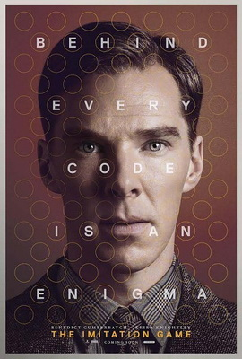

# 《模仿游戏》与计算机科学之父

## 写在前面
说来惭愧，我第一次认识图灵，并不是因为他的图灵机、图灵测试等成就，而是因为《神探夏洛克》看完了没得看了，我又迷上了饰演夏洛克的"卷福"，因此找到了他演的另外一部剧——《模拟游戏》。把在《模拟游戏》中饰演图灵的卷福（上图左）和图灵本人（上图右）放在一起一看，似乎在外貌上没有太多相像的地方（不过有人考证称“卷福”与图灵竟是17代表亲，可追溯到14世纪。从两人各自的父系看，他们均被认为与John Beaufort——第一位Somerset伯爵有亲戚关系）但卷福作为一个高智商角色专业户，在这部电影中确实把图灵这个天才的人物形象演得合乎大众的口味了，影片也最终获得第87届奥斯卡金像奖最佳影片等8项提名，不过电影终归是电影，情节上存在着许多虚构，有太多为了吸引观众而扭曲事实的地方——比如图灵并没有像电影中那么孤僻，和许多优秀的数学家一样，图灵是一个情商很高的人，幽默、平易、讨人喜欢。所以我希望通过重温这部电影并稍稍指出其虚构成分（[维基百科上有列出](https://en.wikipedia.org/wiki/The_Imitation_Game#Critical_response)）的同时和大家讲讲计算机科学之父图灵。

## 人生经历
图灵的人生在他取得的成就上是辉煌的，而反观他的结局，却不禁让人为他感到惋惜，不可不谓为悲剧的人生。影片没有将其一生一览无余地展示给我们，甚至基本上只截取了他人生的几个小片段，主要聚焦于图灵协助盟军破译德国密码系统“英格玛”，从而扭转二战战局的经历，但也向我们展示了那个时代作为一个为国家为世界做出巨大贡献的人却只因性取向不被社会认可而蒙羞自杀的悲剧。 
因为影片除了图灵协助破解"英格玛"系统，扭转二战战局外基本上没有提到他的其他成就，所以我会他的生平经历根据网上的资料简单提一下，再稍具体地根据时间从电影中的图灵作为破解“英格玛”系统的功臣的工作和贡献以及另外几个方面介绍他。
### 人生经历
根据网上的资料介绍，图灵的生平大致如下：
>图灵1912年6月出生于英国伦敦，家族成员里有三位当选过英国皇家学会会员，祖父还曾获得剑桥大学数学荣誉学位。说起来他有不少“学术基因”，可是父亲居里欧的才能十分平常，只是一名在英属殖民地印度的小公务员。  
1926年，图灵考入英国著名的谢伯恩公学，在中学时就获得了国王爱德华六世数学金盾奖章，开始展现数学天赋。16岁时就能弄懂爱因斯坦的相对论——据说全世界当时只有300个人能明白。  1931年，图灵考入英国剑桥大学国王学院，专攻数学。4年后，因为写出论文《论高斯误差函数》，使他由一名普通大学生直接当选为国王学院的研究员，并于次年荣获英国著名的史密斯数学奖，成为国王学院历史上声名最为显赫的毕业生之一。  1936年，他考入美国普林斯顿大学攻读数学博士学位，同年发表了最重要的论文《论数字计算在决断难题中的应用》。  
1938年，图灵回到母校剑桥大学国王学院，作为研究员继续在逻辑与数论方面的理论研究。  1939年加入密码学校，参与破译德军密码。  1943年，担任英美密码破译部门的技术总顾问。  1945年战争结束，图灵离开通讯总部，被英国国家物理实验室聘为高级研究员，专心研究计算机理论。由于他在二战中为破译德军密码做出的巨大贡献，于1946年获得“不列颠帝国勋章”，这是英国皇室授予为国家和人民做出巨大贡献者的最高荣誉勋章。
### 图灵机
图灵机是图灵于1936年提出的一种抽象计算模型，其更抽象的意义为一种数学逻辑机，可以看作等价于任何有限逻辑数学过程的终极强大逻辑机器。它成为现代计算机的理论基础，但这是后话，图灵提出图灵机这一概念并不是为了制造出现代计算机（当然我也不否认他可能有类似的想法），当时仍在剑桥国王学院读本科的他提出这一概念的初衷是为了证明希尔伯特的第三个命题正确与否，最终他通过图灵机的停机问题证明了希尔伯特的第三个命题的答案为否。但是不巧的是，于此同时普林斯顿大学的阿隆佐•邱奇教授——逻辑界数一数二的学者，抢先一步发表了新论文，利用自创的λ演算否定了希尔伯特判定问题，图灵的论文《论数字计算在决断难题中的应用》没有在但是吸引多少目光，不过凭借着这一天才的论文和模型，图灵进入了普林斯顿大学并师从阿隆佐•邱奇，这位抢先他一步拿走第一位给出希尔伯特第三个问题证明的荣誉的大牛。但是这篇论文给他带来的可不仅仅是一个升学机会（尽管升学对他来说完全不成问题），更给他带来了计算机之父的桂冠。图灵发明了“图灵机”，这一成就让我们甚至可以说图灵完成了对现在乃至未来，一切人类所能够制造出来的计算机的设计工作。在他设计了这台作为一切计算机之母的被后人称为“图灵机”的计算机之后，其他人所需要做的，只是去寻找不同的制造材料来搭建一台真实的机器，或者是去寻找提高机器运行速度的方法而已。
### 加速二战结束的传奇
电影中用了大量的镜头讲述了图灵在白金汉郡的布莱切利镇破译德军密码的经历，描绘了图灵孤僻，不合群的人物形象，将整个机器设计制造过程变成了图灵的个人秀，迎合了观众对数学家、科学家等高智商人群的普遍认知。事实上图灵和许多优秀的数学家一样，图灵是一个情商很高的人，幽默、平易、讨人喜欢。并且，对英格玛机的破解在战争开始前就已经开始并取得了一定的进展，波兰的几位密码学家根据恩尼格玛机的原理破译了它，并制造了用于破译的“炸弹”机器，到后来波兰政府将此破译方法告知了英国和法国。而图灵参与破译英格玛机的时候，德军已经察觉并修复了漏洞，使得破译难度大大增加，尽管图灵及其工作团队并不是从什么都没有开始的，而是对波兰人的技术和机器进行改进，但困难程度却一点都不小。图灵的机器最终采用了一种不同的思路设计制造，但也得到了片中没有提到的数学家戈登·魏奇曼的关键启发和帮助。而片中图灵写信给丘吉尔打小报告的桥段也是虚构的，现实中图灵给丘吉尔写信为机器筹款基本上都是联名提出的。所以说图灵在布莱切利园的工作在影片中被大量地虚构，这部电影显然是不能作为一部传记电影的，但是它的确让生活在充斥着计算机、手机等计算机技术中的人们的眼前、耳边、脑海中有了艾伦·图灵的模糊印象，对计算机之父有了一个简单的了解。

### 图灵测试
电影中也没有提到关于图灵测试的事，图灵被称为计算机之父是因为图灵机，被称为人工智能之父则是因为图灵测试，这一部分在我另一篇博文（[聊一聊人工智能](lab01.md)）中有介绍，就不多说了。

### 马拉松运动健将
电影中多次给到图灵跑步的场景，是因为图灵是一位世界级的长跑运动员。他的马拉松最好成绩是2小时46分03秒（手动计时），比1948年奥林匹克运动会金牌成绩慢11分钟。1948年的一次跨国赛跑比赛中，他跑赢了同年奥运会银牌得主汤姆·理查兹（数据来自维基百科）。

## 迟来的道歉与尊重
尽管图灵为计算机的实现打下了理论基础——理想的图灵机，并且对于人工智能的发展有诸多贡献——例如众所周知的图灵测试，但是，作为一个性取向与时代取向相悖的伟大科学家，他因为性取向遭受到的歧视却比作为一个伟大科学家应当受到的尊敬和优待来的早得多，以至于人们在他因同性恋被定“不体面罪”而受到化学阉割并最终自杀的50多年后，一份超过3万人的请愿签名，使英国首相戈登·布朗在《每日电讯报》撰文，因为英国政府当年以同性恋相关罪名起诉图灵并定罪，导致他自杀身亡，正式向艾伦·图灵公开道歉。
>2012年，有21000多人签名请愿，要求英国政府追授图灵死后赦免状，但被当局拒绝。英国上议院的麦克纳利勋爵解释说，死后赦免状是不合适的，因为图灵是根据当时的法律被定罪。 2013年12月24日，在英国司法部长Chris Grayling的要求下，英国女王向图灵颁发了皇家赦免。英国司法部长宣布，“图灵的晚年生活因为其同性取向（同性恋）而被迫蒙上了一层阴影，我们认为当时的判决是不公的，这种歧视现象现在也已经遭到了废除。为此，女王决定为这位伟人送上赦免，以此向其致敬。”

既然遗憾已经无法挽回，就让我们铭记图灵这位为我们的生活带来无限可能的伟人吧。