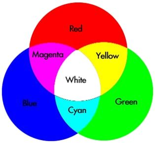
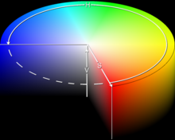
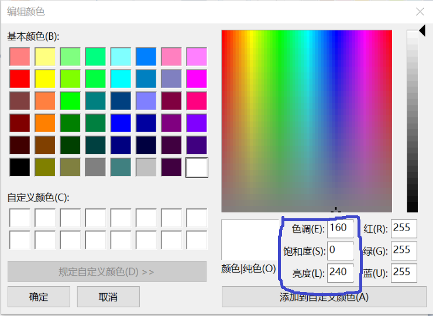

# 颜色编码技术小科普

## 写在前面
近来除了上PML大牛老师的软导之外，同时也在上WQ老师的WEB2.0课程，在网页设计中色彩的选择和搭配是十分重要的，而进行选择和搭配的基础是要知道这么多种颜色应该怎么在计算机、在CSS文件里表达，因此借此机会补习一下颜色的各种编码技术。

## 色光
首先我们人眼可以看到的颜色有两种，一种是像电脑屏幕这种发光体发出光线直接照射到视网膜上经过视觉神经细胞反应产生的，另一种是像画作这样的物体吸收一部分照射在其上的光线后反射入视网膜经神经细胞产生的。因为我们讨论的是在电脑屏幕上显示的颜色，因此属于前一种，即由发光体发出的光线直接照射眼睛上。之所以说一下这个是因为如果画过画或者通过💭可以知道在画画的时候，红绿蓝三种颜色同样的比例混在一起会是黑色，即使不是黑色也不可能是白色，这一点和发光体发出的色光是截然相反的，若红绿蓝三种颜色同比例混合在一起后产生的是白色而不是黑色。也就是说虽然两种我们观察颜色的方式都可以通过颜色组合得到新的颜色，具有类似的性质，但是我们通过颜色组合得到的颜色效果是不一样的。

## RGB颜色模型

### 三原色原理
小学美术课教的三原色原理大家没有忘吧？尽管当时都是用颜料笔作图，并没有在电脑室上美术课，但三原色原理不仅仅适用于颜料作图，同样适用于色光，任何可见光都可以通过这三种颜色以不同的比例搭配得到，这是RGB(Red、Green、Blue)色彩模型的基础原理。

三原色原理

### 表示方法
RGB模型是现在电脑上使用最广泛的色彩标准模型，因此如何如何使用它表示颜色也就显得很重要了。 
RGB三个字母代表了红、绿、蓝三个颜色通道，每种颜色普遍使用一个字节表示其亮度，因此每种色各分为256阶亮度。当三个通道亮度都为0时显示的是黑色，用十六进制表示就是0X000000；当三个通道亮度都是255时显示白色，即0XFFFFFF；当只有其中一个通道为255而其它通道为0时，则显示值为255的那个通道对应的颜色值，如：红——0XFF0000，绿——0X00FF00，蓝——0X0000FF。
简单来说，RGB颜色模型的表示就是如此。

### RBGA
RGBA模型是在RGB颜色标准模型的基础上增加一个字节作为Alpha通道用于表示图像的透明度信息，因此RGBA模式存储像素点使用了4个字节即32位。常见的支持Alpha通道的图片格式有：PSD、TIF、TAG、PNG。

### 颜色深度

上面提到的每个颜色通道亮度使用一个字节表示的方式只是一种表示方式，一般根据每个像素能表现的颜色数可对计算机图片的颜色深度做如下划分：
>8位色（256色模型），每个像素所能显示的彩色数为2的8次方，即256种颜色。
16位增强色，16位彩色，每个像素所能显示的彩色数为2的16次方，即65536种颜色。
24位真彩色，每个像素所能显示的彩色数为24位，即2的24次方，约1680万种颜色。
32位真彩色，即在24位真彩色图像的基础上再增加一个表示图像透明度信息的Alpha通道。

也就是说刚才说的24位表示的RGB和32位RGBA都是真彩色。
那么8位色和16位根据刚才均分的做法好像不能使每个通道具有一样的亮度阶，的确，在这两种颜色深度模型下每个通道的位数是不一样的，在256色模式——共8 bits(B:2 bits;G:3 bits;R:3 bits)；而在增强色模式下：共16 bits（B:5 bits,G:6 bits,R:5 bits)。不过，为了和计算机二进制存储方式相匹配，这样的设计也无大碍。

### 如何获取好看的颜色
设计网页时经常会看到别人的网页上有一些合适自己网页的颜色或配色，这时除了打开控制台查看指定元素的颜色值外，还可以使用ColorZilla（Chrome）插件直接获取。也可以使用windows系统自带画图工具的取色器。另外，可以在类似这样的提供有[颜色选取](https://encycolorpedia.cn/html)功能的网站上选取想要的颜色。

## 其它颜色模型

目前我只接触使用过RGB颜色表示模型，但的确存在其它颜色模型，一般有：CMYK、Lab、HSB。下面只简单介绍一下（不误人子弟）：

### CMYK
这个模式和RGB模式相反，它展现的是刚才提到的反射光展现给我们的颜色。和RGB作为增色色彩模型相反，它是减色色彩模型的代表。四个字母分别表示：C：Cyan ＝ 青色，常被误称为“天蓝色”或“湛蓝”；M：Magenta ＝ 洋红色，又称为“品红色”；Y：Yellow ＝ 黄色；K：blacK ＝ 黑色。这种模式常用于印刷和计算机绘画。CMYK和RGB一样都有8、16、24、32位的颜色深度之分。

### Lab
这个模式弥补了RGB和CMYK各自的缺点，可以说是两者的结合，它是CIE（国际照明委员会）组织确定的一个理论上包括了人眼可以看见的所有色彩的色彩模式。
>Lab有三个通道，它的一个通道是亮度，即L。另外两个是色彩通道，用A和B来表示。A通道包括的颜色是从深绿色（底亮度值）到灰色（中亮度值）再到亮粉红色（高亮度值）；B通道则是从亮蓝色（底亮度值）到灰色（中亮度值）再到黄色（高亮度值）。

### HSB
HSB，也称HSV。在HSB模式中，H(hues)表示色相，S(saturation)表示饱和度，B（brightness）表示亮度。
色相即：在下图所示的0~360°的标准色轮上，根据各种颜色的位置进行度量得到的数值。饱和度即表示色彩的纯度，为0时为灰色，在最大饱和度时，每一色相具有最纯的色光。亮度就不用解释了，即色彩的明亮程度。它一般在色彩汲取窗口中才会出现。

