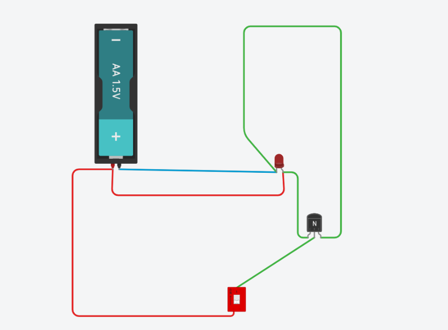
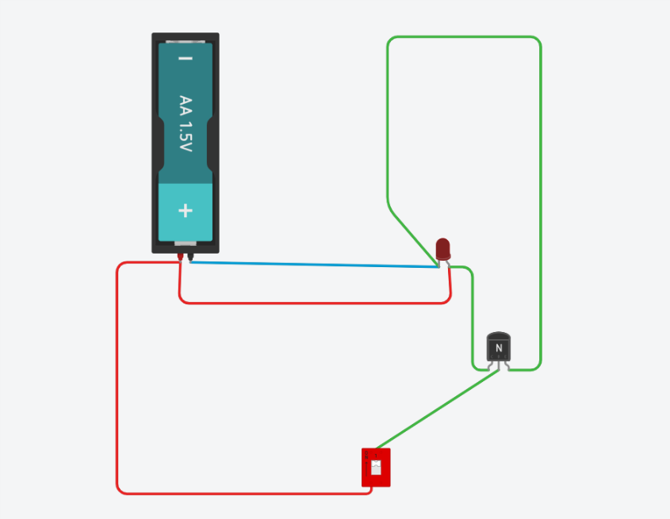
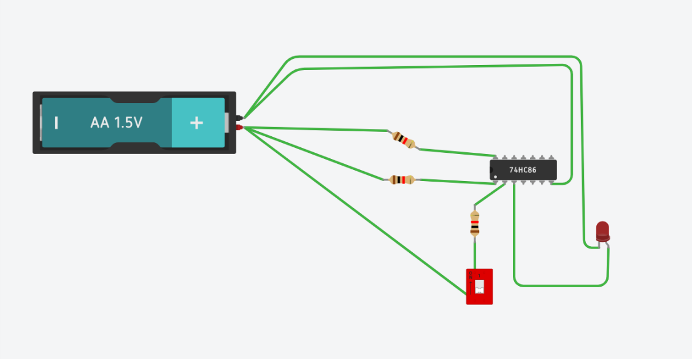
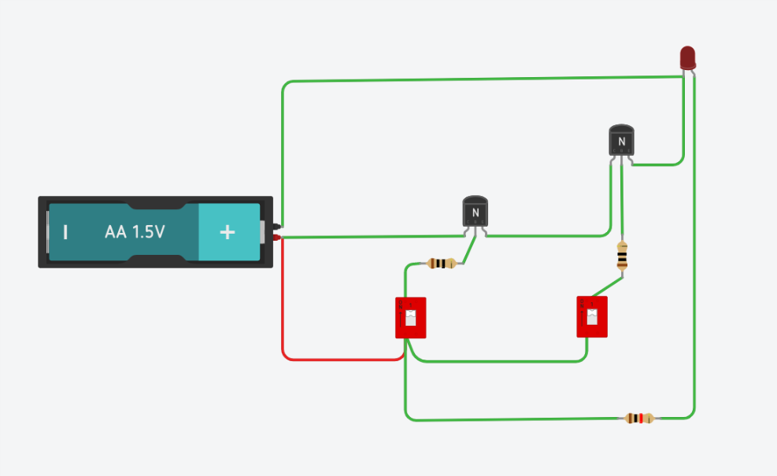
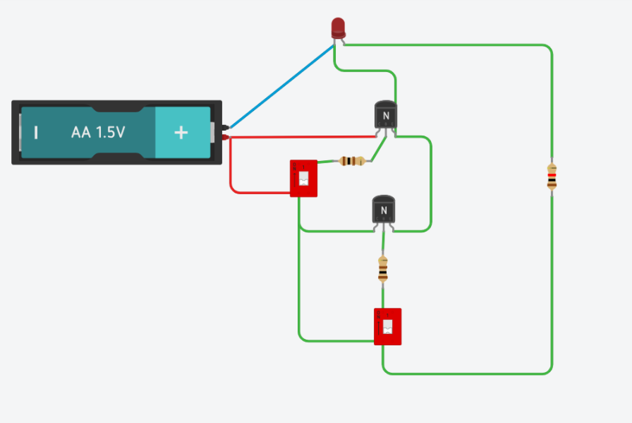
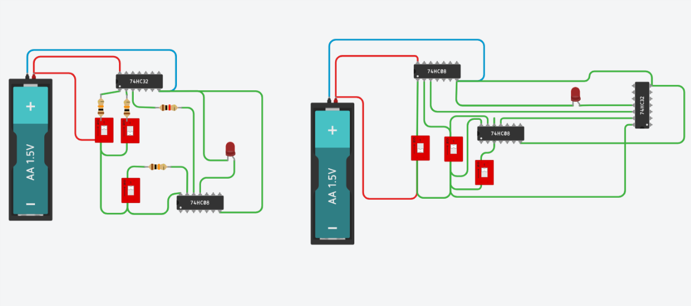
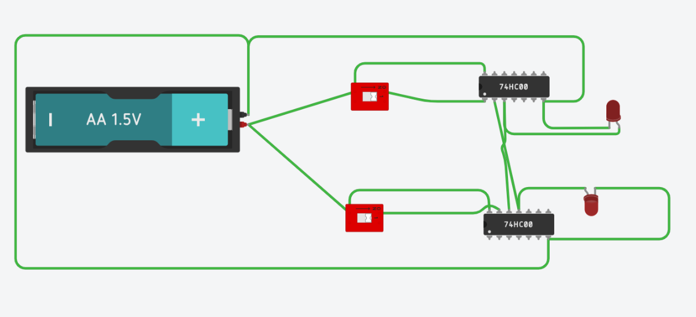
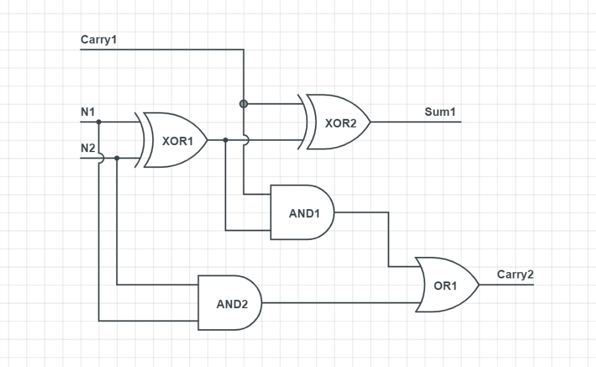
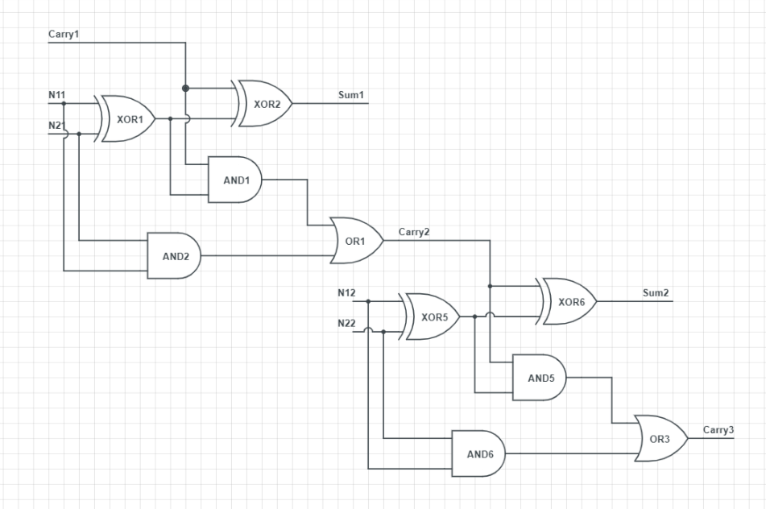

# 硬件编程–电路与二进制运算

## 写在前面 

由于AutoDesk不再提供原电路搭建工具——123D Circuits和原网页在线版，但提供了相应的替代品——Eagle和TinkerCad等工具，我使用的是TinkerCad，所以以下图片可能和原要求作业有些偏差，但意思相同。

## Mission One——非门

### 电路

输入信号为0时，灯亮

输入信号为1时，灯灭

### 真值表

|INPUT(toggle switch)|OUTPUT(led)|
|--|--|
|OFF(0)|Light(1)|
|ON(1)|NoLight(0)|

### 用XOR实现Not门

结果和上面的真值表相对应

### 串联三极管——与非门

当且仅当两个开关都打开（on）时LED不亮，只要有一个开关为off则LED灯亮。
真值表:

|Switch A|Switch B|A XAND B(LED)|
|--|--|:--:|
|0|0|1|
|0|1|1|
|1|0|1|
|1|1|0|

### 并联三极管——或非门

当且仅当两个开关都关闭（off）时LED亮，只要有一个开关on则LED灯不亮。

真值表:

|Switch A|Switch B|A NOR B(LED)|
|--|--|:--:|
|0|0|1|
|0|1|0|
|1|0|0|
|1|1|0|

## Mission Two——验证电路等价

左边图下开关为A，右图中间开关为A

真值表

|A|B|C|O1|O2|
|--|--|:--:|:--:|:--:|
|0|0|0|0|0|
|0|0|1|0|0|
|0|1|0|0|0|
|0|1|1|0|0|
|1|0|0|0|0|
|1|0|1|1|1|
|1|1|0|1|1|
|1|1|1|1|1|

## Mission Three——理解存储电路

真值表:

|~Set|~Reset|Q(X)|~Q(Y)|
|--|--|--|--|
|1|1|0|1|
|0|1|1|0|
|1|1|1|0|
|1|0|0|1|
|1|1|0|1|

## Mission Four——设计全加电路

### 一位的全加电路图

### 两位的全加电路图

