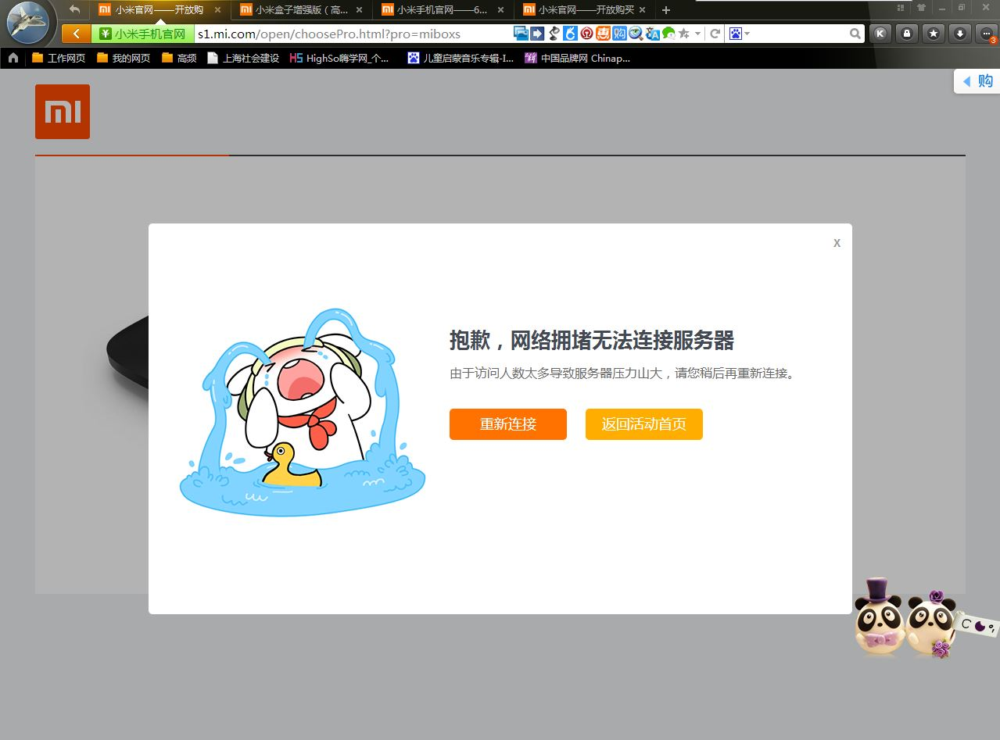
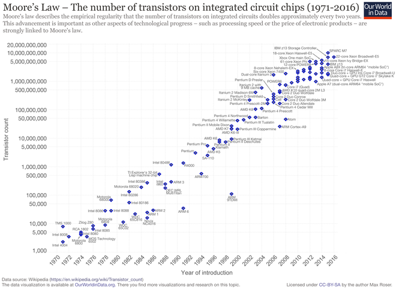

# 小米抢购背后的摩尔定律

## 写在前面

本篇文章写于华为荣耀10客户端，但实话说我还是一个比较忠实的米粉，如果不是上一部小米5实在残破到不能用了我会撑到小米8（当时以为是小米7）上市...好，话说回作业，本来因为是选做而且事情比较多打算不做了，现在有点时间了觉得少一次不好看...那就补上这次选做的作业吧。

小米手机抢购页面

相信尝试过入手小米新品，甚至是像小米手环这些出货已经很久的小米产品的朋友都看到过类似上图的页面，这么反人类、反客户的抢购模式显然已经劝退了不少人，那么为什么雷军要这么做呢？钱赚够了？当然不是，那么下面我们聊一聊为什么小米要这么做。

## 小米的优势

小米之所以能在众多手机厂商中异军突起，如果除开雷军这个核心人物强大的个人能力和人脉及由他带来的一大批技术人员不谈，那么假设你对小米的产品有所了解的话，你会明显得感受到产品的高性价比对小米崛起到了很大一部分作用。
那么产品的高性价比由什么决定呢？性价比即性能与价格之比，显然，性价比要高，要么性能好，要么价格低，要么两者兼顾，而小米就做到了两者兼顾。
性能好一方面是因为自身MIUI系统的长期优化，除了技术人员的功劳，MIUI社区的建立和发展也起到了很大的作用。另一方面离不开和生产链上游厂商（像提供作为判断设备性能好坏的核心CPU的厂商高通等）的密切的、良心的合作，就比如说小米和高通的合作，高通骁龙的最新一代CPU几乎每次都是由小米手机首发搭载的，而高通骁龙CPU应该说是除了苹果垄断的A系列芯片外性能位居第一的。当然性能好的原因有很多，但不是这篇文章的重点，不多说。
那么性价比高的另一个点在于其价格亲民。那么小米是怎么做到在满足高性能的同时将价格始终保持在一个如此低的位置的呢？

## 小米的饥饿营销

>摩尔定律的定义归纳起来，主要有以下三种版本：
集成电路上可容纳的晶体管数目，约每隔18个月便增加一倍。
微处理器的性能每隔18个月提高一倍，或价格下降一半。
相同价格所买的计算机，性能每隔18个月增加一倍。

又搞饥饿营销、但又压低价格，这样看来小米真是个很奇怪的公司,但是让人不能理解的背后往往是领导层深思熟虑后的决策。上面引了一段关于摩尔定律的定义，这是揭开秘密的关键。根据摩尔定律，相同的处理器的价格会随着时间不断下降，那么如果能将未来处理器的价格作为现在的价格呢？价格是不是就降下来了？是的，但是我们并没有时光穿梭机，小米也不可能有，不能真的到未来买到廉价芯片回来卖，那么怎么做到呢？有了！可以先把价格压低，甚至压到亏本，但不卖多，就卖一点点，人们会把你这个时候的价格用于评判你的性价比，这时候就是小米的饥饿营销阶段，这个阶段小米的入账并不多，尽管饥饿营销可能会劝退一部分客户，但大部分人仍然会选择认同它的高性价比。前期少赚钱不代表后期赚钱会少，等到处理器的价格降下来之后，人们会惯性地认为小米手机仍然像几个月前那样拥有超过几乎所有其他品牌手机的性价比，但是尽管其性价比确实很高，但此时已经因为处理器的降价有所折扣了。

事实上这样的分析还很片面，但我能获取的信息并不那么充足，因此以上仅从摩尔定律的角度分析一下，但从这一角度看如果有什么错误欢迎指出！下面附一张摩尔定律的图。

