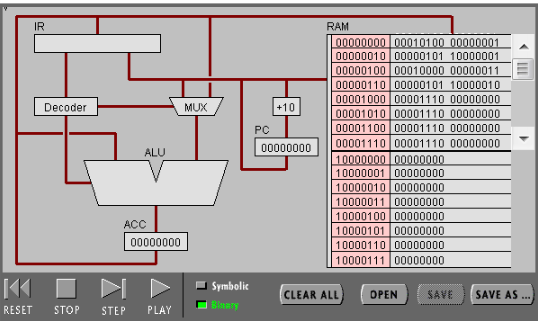

<center>

# 汇编实验报告

</center>

## 一、实验目标：
•	理解冯·诺伊曼计算机的结构
•	理解机器指令的构成
•	理解机器指令执行周期
•	用汇编编写简单程序
## 二、实验步骤 




### Mission One：简单程序
（1）打开网页 The PIPPIN User’s Guide ，然后输入 Program 1：Add 2 number
（2）点step after step。观察并回答下面问题：

>1.	PC，IR 寄存器的作用。
- 答：PC程序计数器的作用是用来指出下一条指令在主存储器中的地址，每执行完一条指令若不跳转则自动增至内存中下一条指令的地址，否则修改值为跳转的地址。
IR指令寄存器的作用是在CPU里用来保存当前正在执行的一条指令。
>2.	ACC 寄存器的全称与作用。
- 答：ACC(Accumulator)即累加寄存器的作用是当运算器的算术逻辑单元ALU执行算术或逻辑运算时，为ALU提供一个工作区，可以为ALU暂时保存一个操作数或运算结果。
>3.	用“LOD #3”指令的执行过程，解释Fetch-Execute周期。
- 答：(PC指向LOD #3指令RAM内存地址)读取PC指向内存处指令到IR→Decoder对指令进行翻译得到指令前八位00010100→通知数据选择器MUX指令的后八位代表数值而不是地址→将操作码0100传到ALU→MUX将从IR提取后八位指令得到数值3传给ALU（无需取址）→ALU进行运算→将结果传给ACC对其赋值→PC+2
>4.	用“ADD W” 指令的执行过程，解释Fetch-Execute周期。
- 答：(PC指向ADD W指令RAM内存地址)读取PC指向内存处指令到IR→Decoder对指令进行翻译得到指令前八位00000000→通知数据选择器MUX指令的后八位代表地址而不是数值→将操作码0000传到ALU→将ACC的数值读取到ALU作为一个操作数→IR根据存储的指令提取后八位得到地址，从指定内存地址处获取数值（需要取址）并传ALU→ALU进行加法运算→将结果传给ACC对其赋值→PC+2
>5.	“LOD #3” 与 “ADD W” 指令的执行在Fetch-Execute周期级别，有什么不同。
- 答：LOD #3指令只用访问一次RAM，不用从RAM中第二次获取操作数，而ADD W指令需要访问RAM两次，需要再从RAM中获取操作数。

（3）点击“Binary”,观察回答下面问题
>1.	写出指令 “LOD #7” 的二进制形式，按指令结构，解释每部分的含义。
- 答：00010100 00000111。前八位为命令指示，后八位为读取的数值或地址。其中命令指示的第四位代表寻址模式，在这里寻址模式位为1代表后八位为数值；命令指示后四位为操作码，这里的0100代表了LOD操作。后八位如前面所说，在这里表示数值，如果寻址模式位为0，那么后八位表示地址值。
>2.	解释 RAM 的地址。
- 答：CPU根据PC中的值作为下一条指令地址在RAM对应地址读取指令；RAM某一地址对于内存中保存着指令（代码区）或数据。RAM的地址最大值越大RAM的内存也越大。另外RAM的数据读写速度和地址无关。
>3.	该机器CPU是几位的？（按累加器的位数）
- 答：8位
>4.	写出该程序对应的 C语言表达。
int8_t w = 3;
int8_t x = 7;
int8_t z = x + w;

### Mission Two：简单循环
（1） 输入程序Program 2，运行并回答问题：
>1.	用一句话总结程序的功能
- 令X从10减至小于0，即-1.
>2.	写出对应的 c 语言程序
```
int8_t X = 10; 
while (X >= 0){ 
–X; 
}
```
（2） 修改该程序，用机器语言实现 10+9+8+..1 ，输出结果存放于内存 Y

>1.	写出 c 语言的计算过程
```
int8_t X = 10; 
int8_t Y = 0; 
while(X > 0){ 
Y += X; 
X--; 
} 
```
>2.	写出机器语言的计算过程
```
00010100 00000000 //LOD #0
00000101 10000010 //STO Y
00010100 00000011 //LOD #3
00000101 10000001 //STO X
00000100 10000001 //LOD X
00001101 00011000 //JMZ 24
00000000 10000010 //ADD Y
00000101 10000010 //STO Y
00000100 10000001 //LOD X
00010001 00000001 //SUB #1
00000101 10000001 //STO X
00001100 00001010 //JMP 10
```

>3.	用自己的语言，简单总结高级语言与机器语言的区别与联系。
- 高级语言和机器语言的区别主要在于高级语言更加贴近于人类的思维模式，而机器语言则是一系列完全出于对计算机电路的状态进行表达的二进制串，人类难以阅读并理解其运行的程序。另一点在于机器语言直接操作计算机硬件操作粒度小，而高级语言有一定的语法和功能限制导致操作粒度较大，因此好的机器语言程序运行效率可以远高于高级语言程序，但机器语言开发效率过低。两者的联系在于高级语言需要在硬件上运行最终需要转换成机器语言，正确的高级语言语句都能转换成相应的机器语言代码。

###实验小结:
- 本次实验加深了我对汇编语言和机器语言的认识以及两者与高级语言之间的关系
- 让我知道了CPU的各个组成部分具体的作用和大致的运行状态，以及CPU计算过程中大致的执行周期。
- 深化了对冯·诺伊曼计算机的结构的理解
- 理解机器指令的构成和它的执行周期