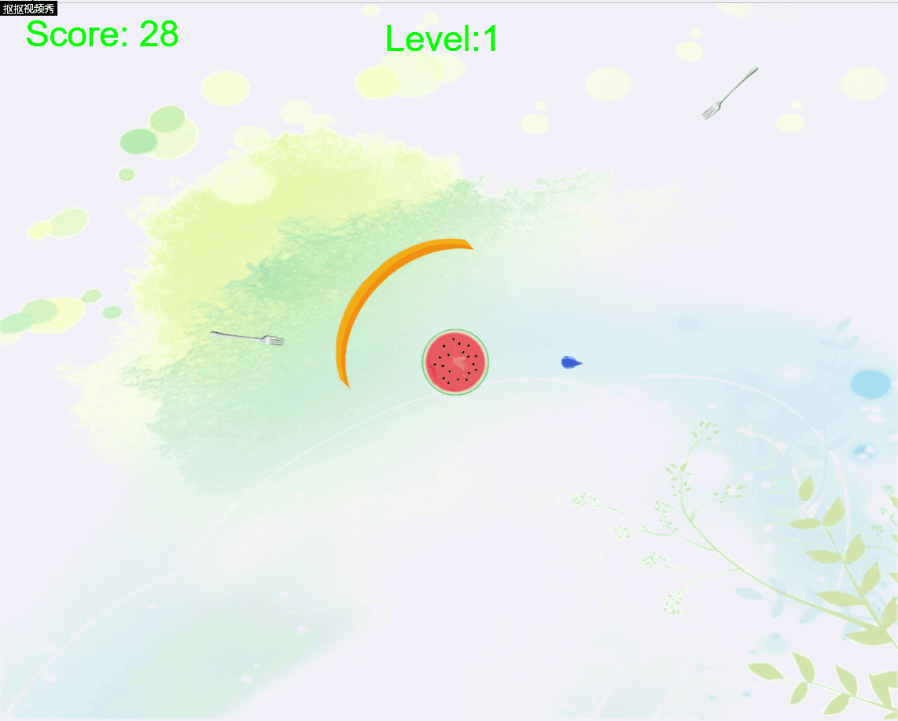
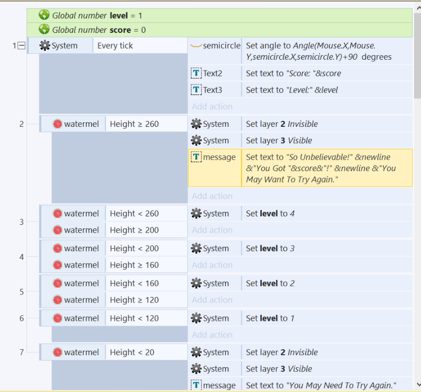
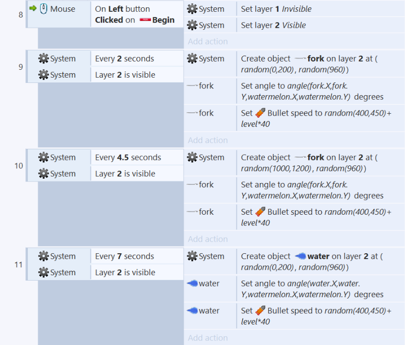
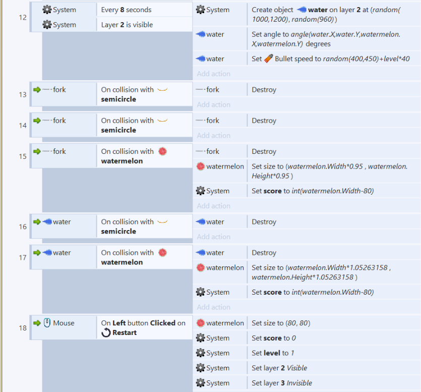

# 保卫西瓜游戏设计

## 写在前面

鉴于之前写的大鱼吃小鱼的游戏的确没有什么亮点，因此这次改做另一个小游戏——[保卫西瓜](https://donggoing.github.io/swi-homework/ProtectWM/index.html)，希望大家喜欢。

## 游戏策划

楔子(Setting)：夏日炎炎，有什么能比一个清凉多汁的西瓜更让人感到舒适惬意呢？但现在你的西瓜正被别人虎视眈眈，需要你保护它！

玩法：通过移动鼠标将保护环转至不同的方向，以抵御来自对你的西瓜虎视眈眈的叉子，当然，别挡住了可以让🍉变得更大的💧哦！当🍉足够大时你就可以顺利地吃上西瓜！而当🍉太小你就失败了，你只能吃西瓜皮了。

### 设定与道具：

- 西瓜：处于屏幕中央，需要你转动保护环对它进行保护，被叉子碰到会变小，而碰到水滴会变大。

- 叉子：从四面八方发出射向西瓜，若碰到西瓜会使西瓜变小，可使用保护环抵御。

- 水滴：从四面八方发出射向西瓜，若碰到西瓜会使西瓜变大，同样可能会被保护环挡住。

- 保护环：可以抵挡住叉子，同样也可能挡住水滴，需要你通过移动鼠标转动保护环的方向。


## GIF成果展示





## 游戏设计/卡片展示

```
+------------------------------------------+  
|西瓜                                      |  
+------------------------------------------+
|你需要保护的对象                           |
+-------------------+----------------------+
| Collaborator      |Events & Actions      |
+-------------------+----------------------+
|叉子               |碰撞&大小减小，score减少|
+-------------------+----------------------+
|水滴               |碰撞&大小增大，score增加|
+-------------------+----------------------+

+------------------------------------------+  
|叉子                                      |  
+------------------------------------------+
|你需要防范的对象                           |
+-------------------+----------------------+
| Collaborator      |Events & Actions      |
+-------------------+----------------------+
|保护环             |碰撞&销毁自己          |
+-------------------+----------------------+
|西瓜               |碰撞&销毁自己          |
+-------------------+----------------------+

+------------------------------------------+  
|水滴                                      |  
+------------------------------------------+
|你需要收集的对象                           |
+-------------------+----------------------+
| Collaborator      |Events & Actions      |
+-------------------+----------------------+
|保护环             |碰撞&销毁自己          |
+-------------------+----------------------+
|西瓜               |碰撞&销毁自己          |
+-------------------+----------------------+

+------------------------------------------+  
|保护环                                    |  
+------------------------------------------+
|你需要操作的对象                           |
+-------------------+----------------------+
| Collaborator      |Events & Actions      |
+-------------------+----------------------+
|鼠标               |移动&转动自己          |
+-------------------+----------------------+
|叉子               |碰撞&销毁叉子          |
+-------------------+----------------------+
|水滴               |碰撞&销毁水滴          |
+-------------------+----------------------+

```


## 游戏制作


游戏制作过程遵循上面给出的CRC卡片进行设计，运用面向对象的思想进行设计，整个过程相对简单，下面直接给出事件表：





试玩地址上面已给出，希望大家喜欢！

如果用的是Chrome，可能因为其安全模式的原因无法正常地玩耍，请按Win+R然后输入chrome --allow-file-access-from-files即可。
