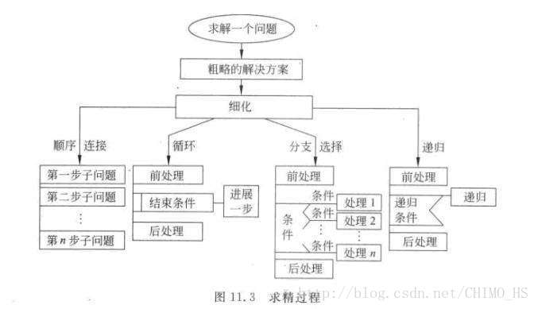

# “自顶向下，逐步求精”(以洗衣机算法为例)

> A top-down approach (also known as stepwise design and in some cases used as a synonym of decomposition) is essentially the breaking down of a system to gain insight into its compositional sub-systems in a reverse engineering fashion.
自顶向下的方法（也称为逐步设计，在某些情况下用作分解的同义词）本质上是系统的分解，以逆向工程的方式深入了解其组成子系统。




自顶向下的方法就是将一个直观上难以解决的、复杂的问题，通过逐步的分解成相对上一步更简单的问题，最终分解成一系列简单易操作的问题的集合。

下面将借助对洗衣机的大致程序的观察了解一下自顶向下方法的实际使用。

首先经过观察发现洗衣机洗衣大致的流程为：选定模式及用水量（或者其它选项）开始→注水至设定水量→电机左右转动洗涤（直到结束）→脱水→排水→提示完成并关机。所以可以写出原始的伪代码：
```
begin
	选择模式与用水量 
	开始
	注水 
	洗涤
	排水
	注水
	漂洗
	脱水 
	排水
	关机
end

```


那么接下来可以开始将问题进行细分，怎么细分呢，我们通过提问的方式来进行：

- 如果注水或排水时水管堵塞或其它情况导致无法进行操作怎么办？
> 检测机内水量是否有改变，若无改变则报错提醒

- 洗衣机如何进行洗涤？
> 查阅资料综合观察得知洗衣机在注入清水加入洗衣液（剂）后，打开洗涤定时器来控制洗涤电机的正反向运转和洗涤工作的时间，通过三角带减速，带动波轮进行正反向旋转，利用波轮正反向旋转产生的水流，来达到洗净衣物的目的。约一个方向转动25s，停止5s，换另一个方向转动。

引入一些较细致的步骤：
water_in_switch(open_close) // open 打开上水开关，close关闭
water_out_switch(open_close) // open 打开排水开关，close关闭
get_water_volume() //返回洗衣机内部水的高度
motor_run(direction) // 电机转动。left左转，right右转，stop停
time_counter() // 返回当前时间计数，以秒为单位
halt(returncode) //停机，success 成功failure 失败

根据细化过的步骤写出伪代码：
```
begin
	Input mod, water volume 
	if(mod为正常洗衣)
		water_in_switch(open)
		repeat
			注水
			if(水量无增加)
				water_in_switch(open)
				halt(fail)
			end if
		until get_water_volume()>=water volume
		water_in_switch(close)
		set start to time_counter()
		while(时间未达到预期时间前或水未排尽时)
			set last to time_counter()
			if(time_counter()-last>25000)
				if(motor_runing(left))
					motor_run(stop)
					wait(5000)
					motor_run(right)
				else
					motor_run(stop)
					wait(5000)
					motor_run(left)
				end if
			end if

			if(排水开关未打开&&(洗涤完毕且未进行漂洗||漂洗完毕))
				water_out_switch(open)
			end if
			if(排水开关已打开&&水位到达放水后预期水位&&未漂洗)
				//排出浊水
				water_out_switch(close)
				//注入清水
				water_in_switch(open)
			end if
			if(注水开关已打开&&水量>=water volume)
				water_in_switch(close)
			end if
			if(排水或进水开关已打开&&水位无变化)
				halt（fail)
			end if
		end while
		water_out_switch(close)
		halt(success)
	else if()...
	else ...
	end if
end
		
```

其实自顶向下的方法不仅能够将问题细化成一个个能够直接解决的小问题，还能够帮助我们将问题的本质剖析清楚，进而使我们能够轻易地将几个相似的问题总结出一套一定范围内通用的解决方案，总结提取完它们的共性模块之后，只需组合几个模块，再传入几个模块的参数就能够完成不同的任务。
根据对不同模式的观察，可以发现其实大部分模式的步骤都是类似的，只是各个步骤的持续时间或次数不同。提取一些共性模块，能够起到简化程序并使程序变得更利于人类理解和修改维护的作用。例如加入如下模块：
- wait(time) //等待指定的时间；
- 注水(volume,timeout) //在指定时间内完成注水，否则停机；
- 排水(timeout)
- motor_run_loop(DuringTime，PerDir)电机左右循环转动，DuringTime参数代表持续时间，PerDir代表每边的转动时间，单位为ms，到达DuringTime后停止转动，若不转动调用halt(fail)


加入上述模块后写出伪代码：
```
begin
	Input mod, water volume 
	if(mod为正常洗衣)
		注水(water volume,2min)
		motor_run_loop(WashTime+RinseTime+DewaterTime+2*DrainTime，25000)
		wait(washTime)
		排水(DrainTime)
		注水(water volume,2min)
		脱水(Dewatertime)
		排水(DrainTime)
		halt(success)
	else if()...
	else ...
	end if
end

```


显然经过提取共性模块简化过的伪代码相对来说更加简洁、更加便于人类理解和修改维护。

所以自顶向下的方法并不仅仅能够使问题化整为零，同样能够帮助我们加深对问题的理解，理解之后能够将一类问题提取出共同的模块，简化问题的解决过程。