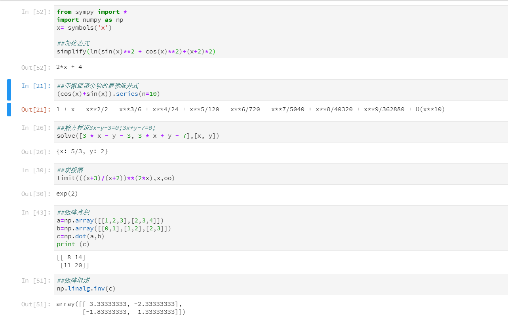

# python 编程实验报告

本次实验所用工具为Anaconda JupterLab，本次学习内容较简单，下面是实验的内容截图，并贴出代码。

```python
from sympy import *
import numpy as np
x= symbols('x')

##简化公式
simplify(ln(sin(x)**2 + cos(x)**2)+(x+2)*2)
## 2*x+4
```

```python
##带佩亚诺余项的泰勒展开式
(cos(x)+sin(x)).series(n=10)

## 1 + x - x**2/2 - x**3/6 + x**4/24 + x**5/120 - x**6/720 - x**7/5040 + x**8/40320 + x**9/362880 + O(x**10)
```

```python
##解方程组3x-y-3=0;3x+y-7=0;
solve([3 * x - y - 3, 3 * x + y - 7],[x, y])

## {x: 5/3, y: 2}
```

```python
##求极限
limit(((x+3)/(x+2))**(2*x),x,oo)

## exp(2)
```

```python
##矩阵点积
a=np.array([[1,2,3],[2,3,4]])
b=np.array([[0,1],[1,2],[2,3]])
c=np.dot(a,b)
print (c)

## [[ 8 14],[11 20]]
```

```python
##矩阵取逆
np.linalg.inv(c)

## array([[ 3.33333333, -2.33333333],[-1.83333333, 1.33333333]])
```

经过这次实验让我再次认识到库的重要性，在尊重别人的劳动成果的前提下不要重复造轮子！