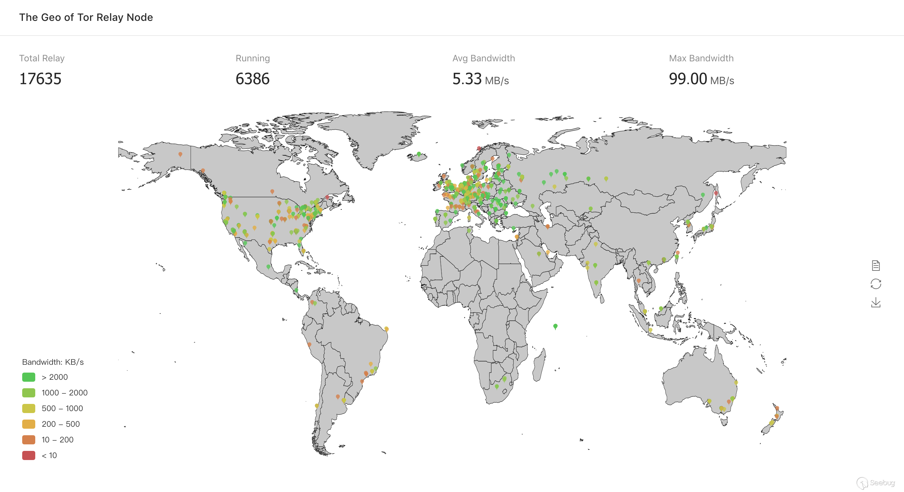
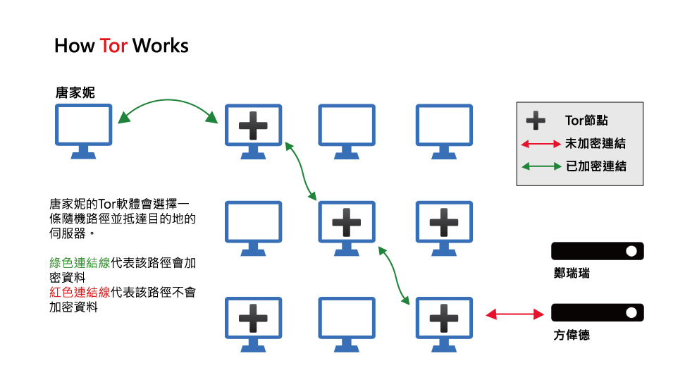

# 99%的黑暗

## 写在前面

>你轻易看见的网络世界的黑暗，不过是冰山一角罢了。

看了标题和前面这句话，对互联网有些了解的童鞋应该已经知道我要写的是什么了——暗网——一个在普通搜索引擎中你无法触及的黑暗网络。它的规模或许不像媒体说的那样大（因为经常将暗网和深网混淆），据资料[2018上半年暗网研究报告](https://paper.seebug.org/686/)显示，暗网所使用的网络节点宽带并不足以支撑起巨大的网络流量(资料中统计了暗网最常用的洋葱网络的节点)，事实上在几次试验性的探索过程中的网络体验并不友好(或许是因为在国内的原因)，但它的黑暗程度绝对对得起这篇文章的标题。

Tor全球节点

## 暗网到底有什么

简单地说，所有你在明网上做不到或者难以做到的、受到政府机构管制的交易、行当，在暗网上只要你有钱（比特币）就可以轻易做到。包括但不限于明码标价的黑客服务、杀手服务、假货、毒品、枪支、护照、假钞甚至人体器官乃至妇女儿童...种种种种足以让一个普通人在短时间内对这个网络产生恐惧并且不会再想再进去看第二次。

TORCH: Tor Search Engine首页广告(导航)

毒品贩卖

当然上面这些只是我所能了解到的一部分，很多令人毛骨悚然的交易内容我接触不到也不愿接触，同时希望进行这些交易的人好好想想自己的行为对自己、对社会带来的危害。

## 初识暗网的技术原理

首先需要搞清楚深网和暗网不是同一概念——暗网是深网的子集。深网是相对于明网而言的，明网是指那些通过搜索引擎能够访问到的网络，而深网是指搜索引擎不能访问到的网络，深网和它的称呼同样，只是指内容相对于公诸于众的明网而言够深，不被大多数人分享，像公司的内部网络、少数人的局域网甚至本地数据等都属于深网的范畴，是互联网发展中自然产生的，不是为了掩盖犯罪活动而产生的。而暗网是指主流浏览器无法访问到的，但通过特殊的软件（Tor、I2P等）、手段、配置能够访问的网络，它的创建者希望将其隐藏，隐藏的目的因人而异，当然也不全是邪恶的（包括特殊的政府工作等）。

了解了这几个概念再来一起简单了解一下技术原理，只了解一下Tor的基本实现原理：

>洋葱路由（英语：Onion routing）为一种在计算机网上上匿名沟通的技术。在洋葱路由的网上中，消息一层一层的加密包装成像洋葱一样的数据包，并经由一系列被称作洋葱路由器的网上节点发送，每经过一个洋葱路由器会将数据包的最外层解密，直至目的地时将最后一层解密，目的地因而能获得原始消息。而因为透过这一系列的加密包装，每一个网上节点（包含目的地）都只能知道上一个节点的位置，但无法知道整个发送路径以及原发送者的地址。

暗网的运作原则是“洋葱路由”，洋葱怎么通过多个全球各地各个不同的分散IP地址重新路由用户的互联网活动，以便掩盖流量最初来自哪台计算机，从而实现网络上的匿名性（这就是电影里经常出现的所谓的黑客技术...），“洋葱”这个描述很形象——一层一层的网络节点将掩盖掉流量的来源，外层的网络即使往洋葱内部溯源追踪也无法确定数据的真正来源。BTW，基于该技术的网页后缀也为onion（洋葱）。
据说这个概念最初是由美国海军提出的，作为保护美国在线情报的一种手段。海军研究实验室的两名数学家经过研究，最终在1997年发布了“洋葱路线”项目——现在更为人所知的是Tor（上面的页面就是用Tor（基于火狐内核）打开的），它利用P2P网络，把网络流量随机的通过P2P的节点进行转发，这样可以掩盖源地址与目标地址的路径。根据刚才提到的“洋葱”的概念应该很容易就能想到越多人使用这个网络，信息来源就越难追查，因此为了让美国政府在其中的真实流量在这个网络中难以分辨，就需要更多的节点达到掩人耳目的效果然后，所以他们将项目部署到公共领域供任何人使用。发展至今，Tor已经成为暗网的关键部分。

洋葱路由怎么工作

## 暗网带来的思考

以洋葱路由等暗网实现的基础技术的出现是为了隐藏传输数据及用户信息，初衷并不是为了建成刚刚展示的如此黑暗的暗网（尽管暗网也不全是黑暗的内容）。技术的好坏在于使用它的人，我觉得这句话用在这上面很契合，在人人都开始注重隐私的社会背景下，隐藏传输数据和用户信息的需求是合情合理的，因此这些技术如果不被干坏事的人利用，它的市场前景乃至政策前景是十分良好的。所以IT技术不存在是否合乎伦理道德的说法，不要企图用伦理道德来制约技术的发展，技术发展是任何人都制止不来的，而需要规范、需要受到制约乃至制裁的，是那些使用这些技术干坏事的人。