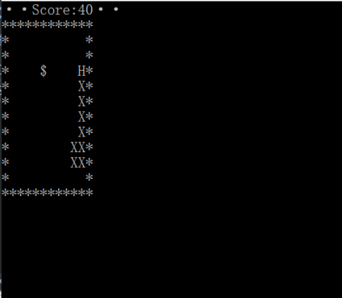
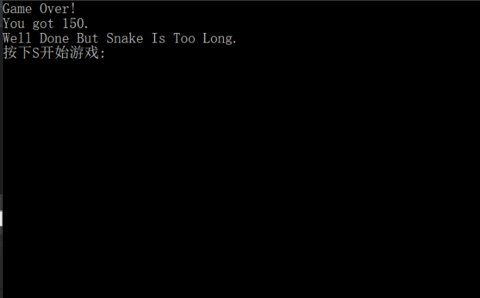

# 字符游戏——贪吃蛇

## 一、实验目的
- 了解字符游戏的表示
- 体验自顶向下的设计方法实现问题求解
- 使用伪代码表示算法
- 使用函数抽象过程


## 三、游戏基本操作和流程

- 按S/s开始游戏
- 按W/w、S/s、A/a、D/d使蛇的运动方向改变
- 蛇若吃到食物则加十分
- 蛇若撞到墙或撞到自己则游戏失败结束
- 蛇若长度达到最大长度则游戏胜利结束


## 二、程序伪代码

由于按要求需要严格按照老师给出的伪代码执行，因此直接引用：
```
输出字符矩阵
	WHILE not 游戏结束 DO
		ch＝等待输入
		CASE ch DO
		‘A’:左前进一步，break 
		‘D’:右前进一步，break    
		‘W’:上前进一步，break    
		‘S’:下前进一步，break    
		END CASE
		输出字符矩阵
	END WHILE
	输出 Game Over!!!
```

## 三、完成情况概要及体验

任务一和二在我的理解上严格按照了要求进行了编写，可能存在着部分偏差。
另外任务二实现上没有使用局部刷新的解决方案可能导致光标闪烁的情况，具体体验视机器情况而定，后续学习改进。



体验过程



胜利结束

## 附件
游戏源文件如下：
任务一：
[snake_move.c](sources/snake_eat.c)
任务二：
[snake_eat.c](sources/snake_eat.c)