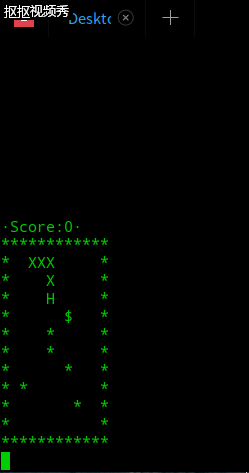

# 智能蛇实验报告

## 前言

该作业完成在前面写于windows系统下的[贪吃蛇小游戏](lab12.md)，区别除了环境从windows改到Linux(Deepin,界面好看:joy:)就是加入了蛇自动寻找食物的模块whereGoNext，尽管这条智能蛇还是会自己玩死，但是暂且把它当作智能蛇吧。

## 实验目的
- 了解 算法 与 “智能” 的关系
- 通过算法赋予蛇智能
- 了解 Linux IO 设计的控制


## 实验环境

操作系统：Deepin 15.7桌面版（虚拟机）
编辑环境：Vim及VsCode均有使用，GCC编译与GDB调试


## 控制输入/输出设备

1.VT 100 终端标准


代码运行效果展示（deepin还是蛮漂亮的）

这一实验任务是我第一次在终端编译程序并运行，体验十分良好！也让我更加了解终端的历史发展过程，并且为后面贪吃蛇的界面显示提供了一定的帮助。

2、实现 kbhit()

这一任务相当于将先前使用的windows下的conio.h中的kbhit在linux环境下进行实现，也就是直接替换先前使用的kbhit函数。主要的问题出现在windows和linux下文件的默认编码保存格式不同造成终端下中文和某些字符显示乱码的情况，查阅资料并使用iconv命令转换编码格式后得以解决。

## 编写智能算法

先回答问题，我觉得长度为5的障碍物能困死该自动跑的蛇吗这问题有点问题，这要看这条蛇的智能程度...我写的这条蠢萌的智能蛇肯定有可能被困死...

### 伪代码

伪代码即题目中给出的(以下有所修改，参数为全局变量无需传入，并修改了一些细节。

```
// Hx,Hy: 头的位置
// Fx,Fy：食物的位置
	function whereGoNext() {
		//表示上下左右四个方向的方向向量
    		set direct[4][2]={ {-1,0},{1,0},{0,-1},{0,1} };
		// 用数组记录可走的方向
		set movable[4]={'w','s','a','d'}; 
		// 用数组记录离食物的距离
		set distance[4]={0,0,0,0};
		// 分别计算蛇头周边四个位置到食物的距离。H头的位置，F食物位置
		set p=0;
		for i from 0 to 4 do
			if map[Hy+direct[2][0][Hx+direct[2][1]]!=BLANK_CELL)
				distance[i]=9999;
			else
				distance[i] = |Fx – （Hx+direct[2][1])| + |Fy – (Hy+direct[2][0]|
			end if
			if(distance[i]<distance[p])p=i;
			end if
		end if
		return movable[p];
	}
```

### 程序框架

程序框架完全符合题意：

```
输出字符矩阵
	WHILE not 游戏结束 DO
        wait(time)
		ch＝whereGoNext(Hx,Hy,Fx,Fy)
		CASE ch DO
		‘A’:左前进一步，break 
		‘D’:右前进一步，break    
		‘W’:上前进一步，break    
		‘S’:下前进一步，break    
		END CASE
		输出字符矩阵
	END WHILE
	输出 Game Over!!! 
```

### 函数设计


最终的函数使得蛇能够自动选择方向，代码如下：

```c
char whereGoNext() {
	char movable[4]={'w','s','a','d'};

	int distance[4]={0,0,0,0};

	int dir=0;

	int Hx=snakeX[snakeLength-1],Hy=snakeY[snakeLength-1];

	for(int i=0;i<4;i++){

		char nexty=Hy+direct[i][0],nextx=Hx+direct[i][1];

		if(map[nexty][nextx]==SNAKE_BODY||map[nexty][nextx]==WALL_CELL)distance[i]=9999;

		else{

			distance[i]=abs(Fx-nextx)+abs(Fy-nexty);

			if(distance[i]<distance[dir])dir=i;

		}

	}

	return movable[dir];

}
```


智能蛇

## 总结

此次实验让我了解了算法与“智能”之间决定性的关系，让智能显得不那么神秘，也让我首次完成了一个不那么智能的智能小程序，通过算法赋予了蛇智能，我觉得除了这些之外，最重要的还是让我了解了 Linux IO 设计的控制，了解了在终端上的简单交互操作，也认识到仍然有许多需要学习的地方。
——已加上一条可人工操作的蛇

## 附

[代码文件](sources/snake_ai.c)
[两条蛇](sources/snake_ai_v2.0.c)