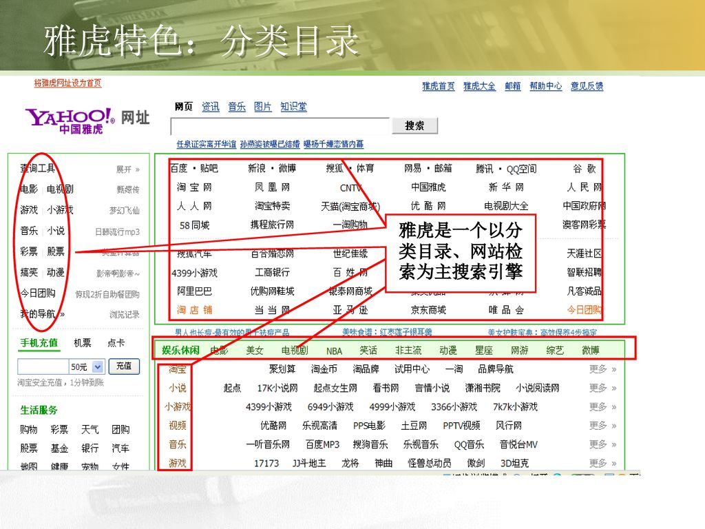

# 互联网时代的盈利模式

## 天下有免费的午餐吗?

前人告诉我们没有，天下没有免费的午餐，天上也不会掉馅饼，那作为一个被电子设备包围的现代人，你是否发现你正在用的许多东西似乎并没有向你索取任何费用，比如你现在正在用的浏览器（基本没有收费的浏览器），比如人人都在使用的微信、QQ等等许许多多的软件尽管有着很高的开发成本，提供着丰富多元的服务但并没有向用户索取直接的费用，难道这些不是免费的午餐？如果答案是肯定的话，那么谷歌公司、腾讯公司等无数的有类似盈利模式软件的公司应该在公司名字上加上“公益”二字，如果作为一家公益公司能做到现在这个规模，那真是人间天堂。好了，言归正传，显然这些免费的软件并不是真的免费的，那它们到底怎么实现盈利的呢？“流量”，流量是怎么帮助软件、公司盈利的？让我们看看第一个使用“流量”实现盈利的公司——

## 杨致远和他的Yahoo

> 杨致远在他攻读博士期间，杨致远和大卫·费罗（David Filo）于1994年4月，共同创立雅虎互联网导航指南，并于次年3月注册成立了雅虎公司。

雅虎事实上只是一个经过人工分类检索的门户网站，但它凭借着开放与免费的商业模式，雅虎的流量呈几何级数增长，以至于它早期得到的红衫风投的资金很快被用完，但很快又有新的风投跟入，为什么这么烧钱的创业公司会有风投这么青睐呢？风投投资人往往是世界上最能看清商业发展未来的一批人，他们看到了Yahoo代表的是一种新的商业盈利模式，并且类似于微软是计算机的入口，Yahoo是互联网的入口，可以说Yahoo是一个有机会与微软齐头并进的公司（尽管后来没能抓住机遇）。
那么雅虎到底是怎么盈利的呢？
很简单，就是广告——最有效也是最常用的流量变现手段。
这是早期雅虎的网站界面，国内像hao123等门户网站都是学习了这种界面风格版式。

雅虎对不同的网站进行分类导航，网站是否在Yahoo上被索引以及它在Yahoo上的位置往往对用户的流向有很强的引导作用，这就给Yahoo的流量变现模式提供了基础，各种各样的网站都会想在这个最大的门户网站上有一个高光的超链接索引来吸引用户。
雅虎开创了这种互联网商业模式，但也因为死守这一商业模式以及在技术上的“不思进取”等一系列原因被后来居上的新兴互联网公司Google打败，尽管如此包括Google在内的绝大多数互联网公司仍然沿用了这一商业模式。

## 只有广告？

尽管广告是流量变现最常用的方式，但仍然存在着其它的流量变现方式，如——
- 电商变现
    - 即淘宝京东等电商网站可直接将流量人群转化为直接消费人群实现变现 

- 内容付费变现
    - 指类似知乎精品课等知识付费的方式，通过引导流量人群消费知识的方式实现变现

- 增值服务变现
    - 指类似QQ会员及其它论坛网站会员等付费获取增值服务的方式实现变现的变现方法

- 等等

## 结束语

尽管雅虎开创了互联网时代的新型盈利模式，但却没能在发展的浪潮下得到很好的发展，说明在快速发展的信息化时代，一个创意的“最好食用期”也在不断缩短，因此在信息化浪潮下的我们要不断地进行创新，才能不断的发展。当前乃至未来几年内互联网的盈利模式或许还会以流量为主，但它终究也会在发展的过程发展、改变、创新。