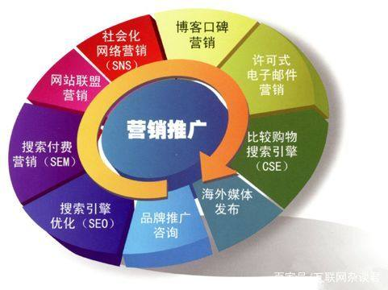

# 互联网时代的热点领域选择、营销方法

## 风口？饥饿营销？

说到互联网时代，也即现在的创业选择和营销方法，大多数人都有所耳闻的应该就是风口和饥饿营销吧，下面我通过边了解边介绍这两个Key Words来展开探讨一下互联网时代的热点领域选择和营销方法。

## 互联网时代热点领域

### 风口

> 小米CEO雷军：创业，就是要找到风口，赶到风口上，猪也会飞。

风口是什么？

> 通俗的讲，是指这样一部分产业或领域，他们因为国家政策的支持、顺应了社会发展的潮流或拥有巨大的盈利潜力，而获得了一个高速发展的机会。在这个基础上，我们说“站上风口”，更多是指一个企业的发展是顺势而为的。

风口是投资者和创业者都在寻找的一个方向，如果能够找准风口，很可能就可以像雷军所说的“风吹🐖飞”了，但是如果真是🐖，当风口过了也是会摔下来的。因此即使运气好站在了风口处，也丝毫不能放松警惕，如果没把翅膀长出来，乘风者从风口上摔下来就和股民看到股价跌停的感觉一样，可以这么比较，风口就像是波浪一样，浪到达浪尖前就已经有一段腾空的距离，这段距离可以比作是风口消失的前兆或乘风者相对于它当前发展状况的技术或管理上的中空、不足，在风口消失前乘风者要尽快的弥补自身水平与当前发展状况的差距免得站在了风口最终还血本无归。

### 怎么寻找热点领域？

风口是一个热词，人人都在寻找风口，但不是谁都能很好地把握，那么互联网时代的热点领域怎么进行选择呢?
- 我也不知道

:joy:但互联网的热点领域的选择首先我们可以从风口的寻找方式中的到启发——风口总是与国家政策挂钩，创业和就业领域的选择也应该趋向于政策利好的领域；除了国家政策我认为还有如下几点：
- 当前的科技发展的前沿方向以及热门的技术应用
- 当前社会发展和人们生活过程中确实存在的痛点的可行解决方案涉及的领域
- 未来十年内可能实现技术突破的领域

### 目前的热点

目前的热点领域既然是热点基本上所有人都应该有所了解了，也就是——
- 5G
    - 有幸的是我国在5G的发展上已经做到了世界领先 

- 人工智能
    - 人工智能近年来由于深度学习算法的研究发展被再次掀起一阵浪潮，也是国家政策扶持的领域之一

- 区块链
    - 区块链是一个新兴的技术方向，技术和实践上已经得到检验，尽管以其为技术基础的比特币在中国还不受政府支持，但区块链技术的发展还是受到国家支持和鼓励的，相信只要需要进行一些规范和继续实践，很快会进入大众的视野并改变人们的生产生活方式

- 物联网
    - 物联网是将万物互联的构想，这一构想正指引着像小米等科技公司的发展规划，相信很快物联网会成为和互联网一样重要的存在

- 大数据
    - 数据在信息时代是和金矿一样的存在，对大数据的发掘和应用正在不断地发展，其成果课帮助政府部门进行决策，帮助指引改进企业的发展运营等环节的进行方式

## 互联网营销方法

### 饥饿营销

饥饿营销我在[小米抢购背后的摩尔定律](lab06.md)一文中就有所介绍，也就是指厂商将发货量压得很低(故意的或确实是产能不足)，采取大量广告促销宣传，勾起顾客购买欲并达到调控供求关系、制造供不应求“假象”、以维护产品形象并维持商品较高售价和利润率的营销策略。这一营销方法有两面性，对于强势的品牌利用得好的话可以增强其品牌效应，而如果用不好的话将会对其品牌造成伤害，从而降低产品的品牌附加值。

### 常见互联网营销方法

这些营销方法听起来都挺高大上的，但营销就是变出花来也就是产品营销者在网络中销售其商品的过程，在互联网时代这个过程变得更加多元。下面介绍几种常见的互联网营销方法：

- RSS营销
    - 即网络电子订阅杂志营销，订阅RSS的用户对订阅内容往往有着较强的需求，因此相对于其它营销方式而言有着较大的优势，但对于没有相关需求的用户显得被动 

- 网络软文营销
    - 即通过各种门户网站、公众号传播一些利于产品销售的信息，把公司的品牌、人物、产品、服务、活动项目等相关信息以新闻报道的方式，及时、全面、有效的向社会公众广泛传播

- 网络图片营销
    - 网络图片营销相较于软文营销而言的优势在于其直观性、趣味性以及信息量大等性质，这些性质使浏览者能够直观地了解到营销者想表达的意愿而不用读长篇大论的文章，图片也经常夹杂在文章中帮助浏览者快速理解，使得他们能不致乏味而快速离开

- 网络视频营销
    - 4G乃至5G的发展使得视频慢慢成为了人们最常用的信息媒介，而各种视频平台的兴起也催生了网络视频营销这一营销手段，你会在抖音、腾讯微视、优酷等平台上看到各个品牌的视频营销视频即广告视频，相较于前两者的优势同样有——直观性、趣味性以及信息量大等

- 网络事件营销
    - 即指商家自己或者雇佣某些专业人员精心策划可以增加商家人气、流量和知名度的事件或活动进而促进大众的消费行为以达到扩大营销的目的

- BBS营销、博客营销、群组营销
    - 这些营销方式都是通过不同的平台向平台用户发送一些关于商品或品牌的文字、图片、视频及活动信息等来增加商家的知名度以达到营销的目的

- 等等

互联网时代下的营销方法多种多样，但都有各自合适的使用场景，不可一味套用，在没有现成的合适方法时还需要发挥创造力想出一个适合的营销方法，因此营销还是一门大学问，我们作为未来的软件工程师也有必要了解一些这方面的知识。

## 结束语

我们作为未来的软件工程师、项目经理、CTO不仅仅要懂得怎么把代码按需求打好，还要懂得软件工程学相关的其它知识。软件工程学需要的不仅仅是目前能得到的最好技术，还需要工程师懂得如何管理，如何与其它背景的合作者交流合作，这就需要我们有丰富的相关知识，因此我们不仅要会打代码，还应该了解点发展历史和趋势、懂点销售、懂点管理······

