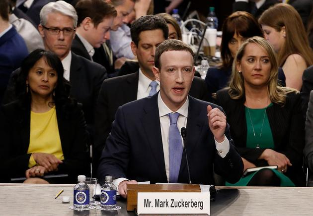

# 我们是否已经成了“透明人”？

## 写在前面

你可曾有接到过骚扰电话、又是否收到过垃圾邮件，且不说这些略微低端的隐私泄露导致的问题，你是否看到过为你“精心”推荐的广告、各种账户密码是否被盗过？
我想这些经历对于任何一个在互联网上玩耍的朋友们都开始习以为常，见怪不怪了。这些总总，无不反映着互联网时代、大数据时代、人工智能时代的发展过程中，用户（隐私）数据被他人合法或非法地大量获取，这些数据又很快被应用于其它场合或被兜售给不法商家，导致用户开始渐渐地失去隐私，开始在互联网上成为一个“透明人”。我们一起探究一下各个可能导致隐私泄露的环节。

## 用户数据获取

### 客户端用户授权获取

>2018年1月3日，支付宝年度账单刷屏朋友圈，但同时也被媒体曝出支付宝年度账单第一页默认勾选“我同意《芝麻服务协议》”，如果用户在进入年账单未选择取消勾选的情况下，将允许支付宝收集用户的信息，包括用户保存在第三方的信息。在被曝光后，蚂蚁信用进行了迅速道歉，称这一行为“非常傻，愚蠢至极”。

手机APP在安装过程中或在运行过程中经常会出现各种“我同意《×××》协议”，你是否真的会仔细阅读后才选择安装？当软件申请某些机器权限时，你是否会仔细考量这些这个权限是不是这个APP真的必要的而不是为了获取某些像通话记录、聊天记录等的隐私数据？这是用户数据泄露问题泛滥的重要原因之一。当然，某些软件获取的权限的确是完成它功能的硬性要求，但获取这些数据之后却没能很好地保存甚至某些不法的应用商会将这些数据打包出售（这样的数据在地下黑市上数量相当多）。可能这样一带而过我们对这些数据的用途不那么清楚。
软件获取的手机权限最常见的就是读取短信、读取通话记录、读取手机信息（已安装程序等）。某些软件读取短信的功能不仅仅局限于新的未读的短信内容，还包括那些已读的短信信息，这样的话你是不是开始方了？而事实上这种方法的代码在网上一查就能查到。如果被不法分子获得了你某些隐私的短信，即使有幸没有蒙受财务上的损失，你内心又会作何感想？通话记录亦是如此，获取该数据商家还可以根据你的通话记录确定你的潜在需求，对你进行电话咨询（骚扰），另外通过通话时长和通话对方的画像对用户进行画像。精确定位这一权限使得手机信息数据方面，某些不法商家可以根据获取你手机中已安装程序对你进行画像，可以猜测出你是否是他们的潜在客户，如果是，那么骚扰电话就跟着来了，当然如果真的是你需要的，你是否会想他们是怎么知道我需要这个东西的呢？这些权限信息都是用来拿到你的数据——能精准的描述你的个人信息，做所谓的用户画像，合理的利用这些数据可以使得用户得到精确的服务，但如果被不法商家得到这些数据，后果有时就不仅仅在于几个骚扰电话，而可能造成财产损失等其它更严重的损失。

### 网络运营商处窃取
[瑞智华胜涉窃取30亿条个人信息：非法牟利超千万元](http://finance.sina.com.cn/stock/thirdmarket/2018-08-20/doc-ihhxaafz0581317.shtml)
这则新闻是今年8月份的，这家瑞智华胜及其关联公司在与正规运营商（包括电信、移动、联通、铁通、广电等11个省市的运营商，这些运营商均与涉案公司签署过合作协议）合作中，会加入一些非法软件用于清洗流量、获取用户的cookie，cookie是用户在运营商上留存的上网记录，通过技术手段可以从中提取公民个人信息、相关账号密码、搜索的关键词等内容。通过这种方式，该公司能够得到用户在网页浏览过程中产生的包括账号密码等信息，凭借着这些数据，该公司能轻易地登陆大量用户的账号，并以此为基础发展运营热门公众号、外来加粉、加关注和提升百度搜词排名等需要大量用户的业务。

所有的用户数据大多数都会经过网络运营商，因此图谋不轨的组织、商家乃至某些有特殊目的的国家只要搞定了他们，那么这些用户隐私数据便会源源不断地被他们获取。

### 服务提供商

[华为和腾讯陷入用户数据之争，腾讯要求政府介入](https://www.huxiu.com/article/208436.html)

服务提供商为了提供给用户更好的服务，会存储大量用户的个人信息包括大量的隐私信息，这些数据对于不法分子乃至其他公司都是“金矿”般的存在，因此华为与腾讯之争也不足为奇。如果公司有足够的用户维权意识，那么最好，倘若某些公司没有，那么这些公司、这些服务提供商也走不长久。这些科技互联网公司们必须遵守法律，守住底线，尊重自家用户才能长久的生存发展下去。

### 服务器数据流量监控

>在斯诺登的爆料里，谷歌、雅虎、微软、苹果、Facebook、美国在线、PalTalk、Skype、YouTube等九大公司遭到参与间谍行为的指控，这些公司涉嫌向美国国家安全局开放其服务器，使政府能轻而易举地监控全球上百万网民的邮件、即时通话及存取的数据。
随后，这些企业极力否认这一罪名。但到了6月14日，Facebook、微软两公司首次承认，美国政府确曾向它们索要用户数据，并公布了部分资料数据内容，以期尽早摆脱“棱镜门”泥淖。
斯诺登揭露美国国家安全局通过思科路由器监控中国网络和电脑。

斯诺登事件大家肯定都有所了解，他曝光的美国政府的“棱镜”计划着实给了国人乃至全世界人民不小的恐慌，上面给出的这些公司的产品我相信大家或多或少都有用过，或多或少地在上面留下了一些自己的信息或使用痕迹。这其中最普遍的当数谷歌了吧，尽管目前需要借助某些科学上网工具才能访问谷歌，这让许多需要获取更多在国内搜索引擎难以检索到的资料的人（包括但不限于进行学术研究的学者们）感到不适，但或许这也是为了保护国人的个人信息不被泄露，尽管泄露到国内对用户来说可能更难受（相对来说泄露到国内从国家层面来看更好）。

### “窃取”大公司用户数据

[Facebook用户数据泄露事件](http://m.dsj365.cn/front/article/6019.html)

>Cambridge Analytica在2016年美国总统大选前获得了5000万名Facebook用户的数据。这些数据最初由亚历山大·科根通过一款名为“this is your digital life”的心理测试应用程序收集。通过这款应用，Cambridge Analytica不仅从接受科根性格测试的用户处收集信息，还获得了他们好友的资料，涉及数千万用户的数据。能参与科根研究的Facebook用户必须拥有约185名好友，因此覆盖的Facebook用户总数达到5000万人。
因为科根教授将数据共享给了剑桥分析这么一家商业公司，导致Facebook上超5000万用户信息在用户不知情的情况下，被该公司获取并利用。期间在Facebook察觉后已责令删除，剑桥分析也回应已经删除，然而事实上并这些被滥用的用户数据并未被销毁。因此我认为在剑桥分析回应已删除数据后开始其继续使用用户数据的行为就属于窃取用户数据，罪魁祸首应该是它。不过Facebook在软件上的确存在Bug，管理上存在缺陷。Facebook用户数据泄露事件之后在十天内市值蒸发千亿，名誉也受到相当大的损害，接受了沉重的教训，但无论事件的责任到底在谁，用户数据的确都被非法使用了，所以大公司既然掌握了大量的用户数据，就应该对这些用户数据、对这些相信他们的用户负责！

### 骇客攻击获取数据
[黑客入侵华住酒店，5亿用户开房数据遭窃取，10000条隐私7块钱](https://t.cj.sina.com.cn/articles/view/3078334817/b77ba96100100a5xv)

从客户端到路由再到服务器，上面提到的任何一环都可能成为骇客攻击获取用户隐私数据的入口，当然，一般骇客会攻下最薄弱的一环，然后需要且可能的话再逐步攻下其它环节。比如说很多用户在不同网站上注册的账号和密码都是一样的，倘若其中一个网站是像微信这样安全系数相对很高的，骇客不会选择去直接攻击这样的服务器，而是会选择攻击其它安全性较弱的网站服务器，利用获取的用户账号密码等数据进行试验，这种破解方法（撞库攻击）比直接攻击那些安全系数很高的服务器来说简单得多，并且端掉一个服务器，获取的用户数据量也相当可观，这也是为什么腾讯发展了这么久仍然存在很多用户账号被盗的情况的原因之一，不是他们安全系数不够高，而是网站的安全性和网友的安全意识平均水平较低。因此我建议用户的账号密码最好根据所注册网站的安全性以及可能涉及的个人信息进行简单的分级，这样能有效地防止图谋不轨者有可乘之机。实话说这些黑客手段我也一知半解就不班门弄斧了。

[暗网叫卖知名网站千万用户数据？揭秘黑产如何操作](https://www.aqniu.com/threat-alert/35013.html)

### 线下信息泄露

>2017年4月，湖北荆州某快递公司员工利用工作便利，专门收集购买书画、保健品、纪念币等贵重物品的客户快递单，整理后再转手卖给兜售伪劣保健品、假冒收藏品卖家，供其实施精准诈骗。
2017年下半年，有不法人员从小区保安人员、快递员手中收集住户信息，除了少数人会用于满足窥探、猎奇等需求外，大多数购买者旨在通过用户信息谋取利益。比如针对特定身份的人群发放产品广告。还有一些人会利用用户信息进行金融窃取、敲诈勒索等活动。

上面的事件仅仅是在你未收到快递前发生的隐私泄露问题，那么每次取到快递时看着写着你名字、电话、地址、购买物品等信息的快递单，你是选择丢掉还是撕掉？我想很多人不会去在意，会直接丢掉它，那么你的个人隐私也就顺手丢掉了。图谋不轨者可以通过翻垃圾桶对你家的情况进行一个大致的了解，进行像入室盗窃、电话销售等行为。当然，这样的手段的确比不上新闻所提到的直接向快递员甚至快递站点、淘宝卖家、快递公司购买用户快递单数据，通过这样的手段获得的用户数据，会是不法分子眼中的香饽饽。针对快递员的不当行为，很多快递公司开始使用隐私面单，但事实上我经常还是能收到一些没有进行隐私处理的快递单，所以目前来看尚未很好地普及。而如果快递公司与不法分子蛇鼠一窝，那么怎么也防不住你的隐私泄露了，当然这样的公司存活不了多久。因此，我们为了保护好我们的隐私，还是在我们能做的地方做好，将快递单撕碎了再扔吧。

## 用户数据交易

以上种种方法获得的用户数据如果仅仅被获取方单方面使用已经让人够头疼了，但还有不少不法分子获取这些数据后不仅仅自己使用，还会将这些数据进行打包出售。这些数据显然是不合法的，那么显然不宜在政府可监控的网络下进行大量贩卖（尽管可能有某些脑子不太清醒的不法商家），那么是不是没有地方交易这些数据呢？当然不是，这些商家很多都是有比较强的网络基础的（比我强），因此他们当然会知道有这么一个地方——暗网。

[暗网售卖中国10亿账户数据,主要来自腾讯,网易,新浪等互联网公司](https://www.wosign.com/news/2017-0203-01.htm)

[暗网叫卖知名网站千万用户数据？揭秘黑产如何操作](https://www.aqniu.com/threat-alert/35013.html)

当然除了在黑产市场交易，线下交易或是点对点的线上交易也是可行的。

##谈谈看法

我们是否已成了“透明人”？我想对于大部分来说回答是肯定的，在快节奏的现代生活中，快速获取自己所需的信息成了一项重要的能力，能够在达到这一要求的条件下注重自己的隐私保护的确难以做到。我认为在这个大数据的时代，个人信息是技术发展的重要养分，因此重要的不在于我们是否已经在互联网上成了“透明人”，而是我们在谁面前是“透明”的，以及这些能够掌握我们个人信息的人是否可靠，是否正在利用这些数据为我们提供更好的服务抑或是为科技进步、社会进步做出努力！